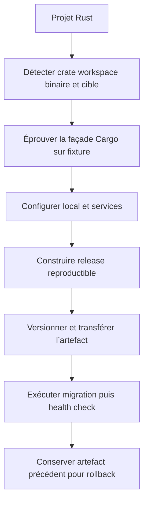
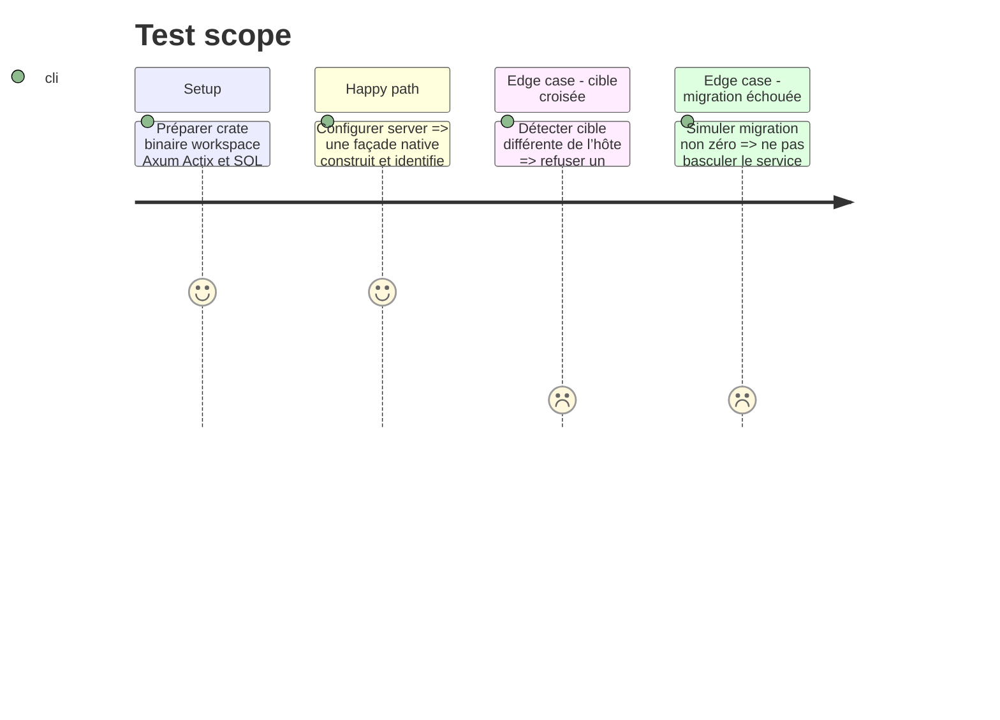

# Instruction: Décliner cd pour les releases Rust

## Architecture projection

> Tree of the final files. ✅ create · ✏️ modify · ❌ delete

```txt
plugins/sc-rust/skills/cd
├── SKILL.md                                          ✅ stratégies crate workspace service binaire
├── actions/01-local.md                               ✅ toolchain services et run local
├── actions/02-server.md                              ✅ release artefact migration contrat et cible
├── actions/03-automata.md                            ✅ validation puis remise à sc-tiers
├── references
│   ├── command-facade.md                             ✅ arbitrage Cargo et task runner
│   ├── releases.md                                   ✅ version tag artefact cible et rollback
│   └── sql-delivery.md                               ✅ SQLx Diesel rusqlite
└── evals
    ├── scenarios.json                                ✅ routes et refus
    └── delivery-scenarios.md                         ✅ fixtures de release
```

## User Journey



## Test Scope



## Tasks to do

### `1)` Arbitrer la façade Rust

> Fournir une commande mémorisable sans inventer une capacité de Cargo.

1. Tester alias Cargo, binaire projet ou task runner sur une fixture versionnée.
2. Retenir la forme qui relaie arguments et codes de sortie et fonctionne localement comme en CI.
3. Ne pas ajouter de dépendance externe globale sans décision explicite.

### `2)` Définir l’unité de release

> Faire de la release un artefact identifiable et réversible.

1. Détecter crate, workspace, binaire, features, cible et profil.
2. Associer version ou commit, checksum, configuration externe et répertoire de releases.
3. Prévoir health check et conservation de la release précédente avant bascule atomique.

### `3)` Intégrer runtime et SQL

> Adapter service et migrations aux crates réellement présentes.

1. Réutiliser les signaux Axum, Actix, SQLx, Diesel et rusqlite de `sniff`.
2. Séparer compilation, transfert, migration et redémarrage.
3. Arrêter avant bascule si build, checksum, migration ou health check échoue.

## Test acceptance criteria

| Task | Acceptance criteria |
| ---- | ------------------- |
| 1 | La façade retenue exécute la même procédure sur poste et CI, transmet les arguments et relaie un échec. |
| 2 | Chaque artefact et le contrat projet portent une identité vérifiable, et une release précédente reste sélectionnable après déploiement. |
| 3 | Une migration ou un health check en échec empêche la bascule ; aucune stratégie d’une crate absente n’est appliquée. |
