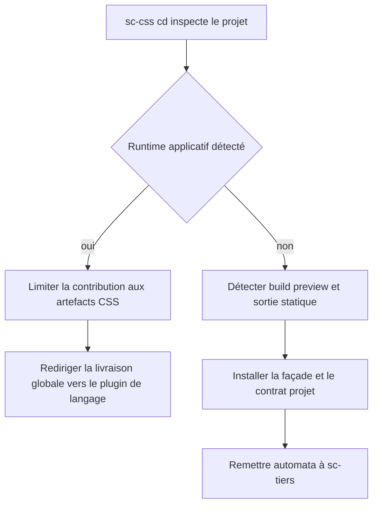
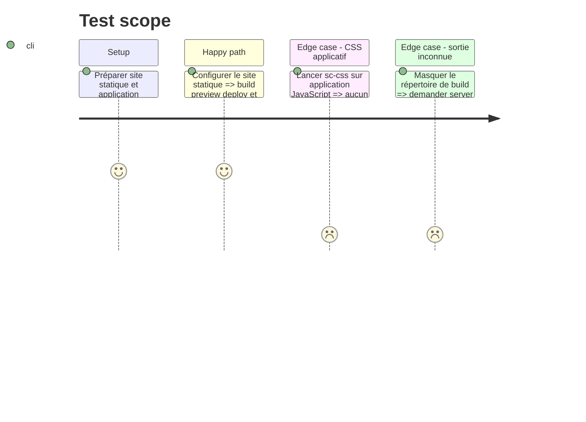

# Instruction: Décliner cd pour la livraison statique CSS

## Architecture projection

> Tree of the final files. ✅ create · ✏️ modify · ❌ delete

```txt
plugins/sc-css/skills/cd
├── SKILL.md                                          ✅ borne statique et redirection runtime
├── actions/01-local.md                               ✅ build et preview CSS ou statique
├── actions/02-server.md                              ✅ artefacts statiques et contrat projet
├── actions/03-automata.md                            ✅ validation puis remise à sc-tiers
├── references/static-delivery.md                     ✅ build output exclusions cache
└── evals
    ├── scenarios.json                                ✅ routes et refus CSS
    └── delivery-scenarios.md                         ✅ statique pur et projet composite
```

## User Journey



## Test Scope



## Tasks to do

### `1)` Borner la propriété de sc-css

> Couvrir le statique sans prendre la place du runtime applicatif.

1. Détecter si un plugin de langage possède déjà build et livraison globale.
2. Dans un projet composite, ne gérer que la contribution CSS et rediriger le reste.
3. Dans un site statique sans runtime propriétaire, accepter la propriété de la procédure.

### `2)` Installer local et server statiques

> Réconcilier les commandes uniquement lorsque build, preview et sortie sont déterministes.

1. Détecter gestionnaire, commande de build, preview, répertoire de sortie et fichiers exclus.
2. Exposer la façade `deploy:*` native et écrire le contrat projet sans secret.
3. Déclarer identité de source, contrôle de l’artefact publié, politique de cache et récupération.

### `3)` Router automata sans duplication

> Remettre une procédure déjà prouvée au propriétaire des enveloppes CI.

1. Valider le contrat contre la façade et la sortie statique.
2. Invoquer `sc-tiers:cd automata` seulement s’il est disponible.
3. Sans `sc-tiers`, arrêter sans écriture et nommer le prérequis public.

## Test acceptance criteria

| Task | Acceptance criteria |
| ---- | ------------------- |
| 1 | Un site statique est possédé par sc-css, tandis qu’une application composite conserve son unique propriétaire de langage. |
| 2 | Build, preview, sortie et contrat concordent après deux exécutions ; une sortie inconnue ne produit aucune cible. |
| 3 | Automata consomme la commande existante via sc-tiers et n’écrit aucun fallback lorsque ce plugin manque. |
