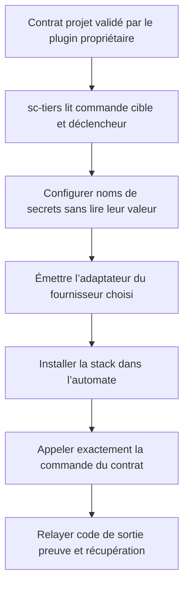
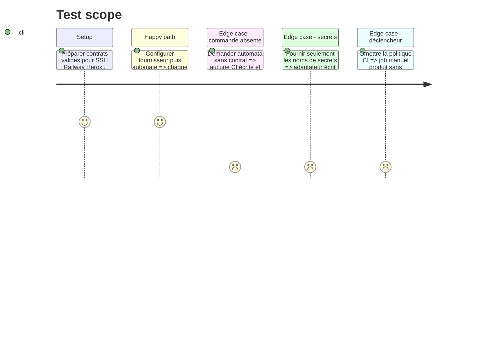

# Instruction: Décliner cd pour les fournisseurs et automates

## Architecture projection

> Tree of the final files. ✅ create · ✏️ modify · ❌ delete

```txt
plugins/sc-tiers/skills/cd
├── SKILL.md                                          ✅ fournisseurs et automates
├── actions/01-local.md                               ✅ émulateur ou N/A explicite
├── actions/02-server.md                              ✅ configuration fournisseur bornée
├── actions/03-automata.md                            ✅ GitHub GitLab Railway Heroku
├── references
│   ├── providers.md                                  ✅ primitives et secrets par fournisseur
│   └── ci-adapters.md                                ✅ workflows minces appelant deploy
└── evals
    ├── scenarios.json                                ✅ routes et refus tiers
    └── delivery-scenarios.md                         ✅ preuves de non-duplication
```

## User Journey



## Test Scope



## Tasks to do

### `1)` Créer les adaptateurs fournisseurs

> Encapsuler les primitives officielles derrière la procédure projet existante.

1. Couvrir d’abord SSH classique, Railway et Heroku avec détection et prérequis explicites.
2. Déclarer les noms de secrets requis sans jamais collecter ni versionner leur valeur.
3. Conserver un état unsupported pour tout fournisseur non éprouvé.

### `2)` Créer les adaptateurs GitHub et GitLab

> Générer des enveloppes minces, sans logique de livraison concurrente.

1. Installer la stack et ses dépendances verrouillées.
2. Appeler textuellement la commande `deploy:*` et le répertoire déclarés par le contrat.
3. Appliquer `manual` par défaut et `push` uniquement lorsque le contrat l’a explicitement choisi.

### `3)` Relayer le verdict natif

> Laisser la procédure propriétaire décider du succès et du remède.

1. Relayer le code de sortie sans l’ignorer ni le réinterpréter en succès.
2. Exposer identité de source, preuve après livraison et voie de récupération fournies par le contrat.
3. Refuser contrat absent ou périmé, commande divergente et fournisseur non couvert avant toute écriture.

## Test acceptance criteria

| Task | Acceptance criteria |
| ---- | ------------------- |
| 1 | SSH, Railway et Heroku n’embarquent aucune valeur de secret et échouent proprement si leur primitive manque. |
| 2 | GitHub et GitLab appellent textuellement commande et répertoire du contrat, avec déclencheur manuel par défaut. |
| 3 | Un échec non zéro reste un échec, preuve et récupération sont relayées, et aucun contrat absent ou périmé ne produit d’automate. |
