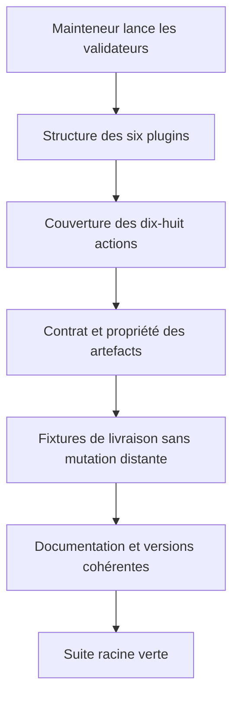
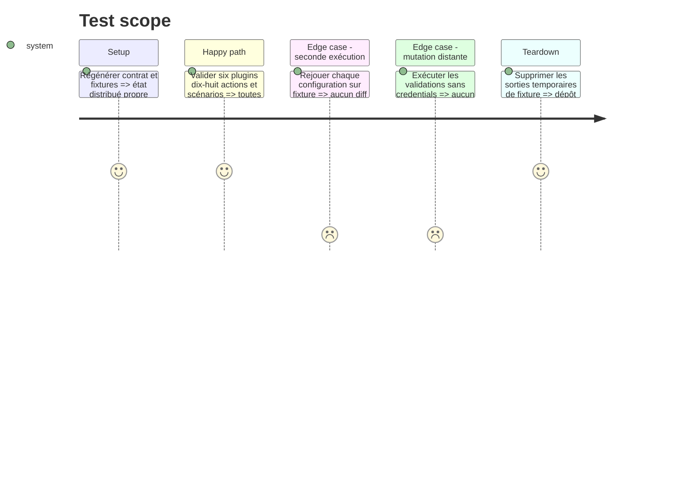

# Instruction: Valider et distribuer la famille cd

## Architecture projection

> Tree of the final files. ✅ create · ✏️ modify · ❌ delete

```txt
.
├── README.md                                         ✏️ documenter la famille cd
├── .claude-plugin/marketplace.json                   ✏️ versions et descriptions des six plugins
├── tools/eval/sc-cd.mjs                              ✏️ garde finale et fixtures intégrées
└── plugins
    ├── sc-css                                        ✏️ manifests, README, changelog, scénarios
    ├── sc-js                                         ✏️ manifests, README, changelog, scénarios
    ├── sc-php                                        ✏️ manifests, README, changelog, scénarios
    ├── sc-python                                     ✏️ manifests, README, changelog, scénarios
    ├── sc-rust                                       ✏️ manifests, README, changelog, scénarios
    └── sc-tiers                                      ✏️ manifests, README, changelog, scénarios
        fichiers modifiés dans chacun
        ├── .claude-plugin/plugin.json                ✏️ bump mineur et description
        ├── .codex-plugin/plugin.json                 ✏️ même version plus cachebuster
        ├── README.md                                 ✏️ commandes capacités et limites
        ├── CHANGELOG.md                              ✏️ ajout cd et migrations éventuelles
        └── skills/cd/evals/scenarios.json            ✏️ couverture finale positive et négative
```

## User Journey



## Test Scope



## Tasks to do

### `1)` Étendre les preuves intégrées

> Vérifier le contrat transversal et les frontières propres aux stacks.

1. Couvrir local, server et automata dans les six plugins, plus les voisins qui ne doivent pas router.
2. Ajouter fixtures minimales pour les combinaisons nominales et les risques destructifs.
3. Tester idempotence, absence de secret, absence de staging, sens des commandes, unicité du propriétaire racine et bornage des contributeurs.

### `2)` Documenter les capacités réelles

> Publier une interface compréhensible sans promettre les gaps.

1. Ajouter `cd` aux tableaux des six README et au README racine.
2. Documenter commandes installées, stacks couvertes, fournisseurs, limites et migration PHP.
3. Nommer Python et Rust selon l’arbitrage réellement prouvé dans leurs phases.

### `3)` Versionner et valider

> Distribuer l’ajout rétro-compatible en gardant tous les registres cohérents.

1. Appliquer un bump mineur aux six manifests Claude, aux versions Codex avec cachebuster et au catalogue Claude.
2. Ajouter une entrée de changelog par plugin ; ne pas modifier `index.json` ni dupliquer les versions dans le catalogue Codex.
3. Exécuter validateurs plugin et skill, gardes déterministes et `pnpm test`.

## Test acceptance criteria

| Task | Acceptance criteria |
| ---- | ------------------- |
| 1 | Les dix-huit actions sont routables, les fixtures de risque échouent comme prévu et une seconde exécution ne crée aucun diff. |
| 2 | Chaque README distingue capacités, limites et propriétaire ; aucun fournisseur ou framework absent n’est annoncé comme couvert. |
| 3 | Les versions sont cohérentes dans les deux manifests et le catalogue Claude, tous les validateurs passent et aucune validation ne contacte une production réelle. |
