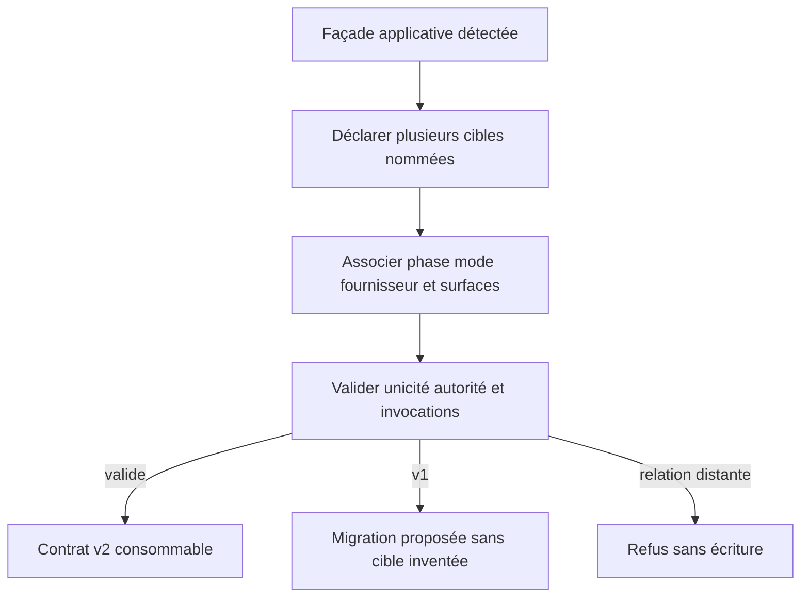
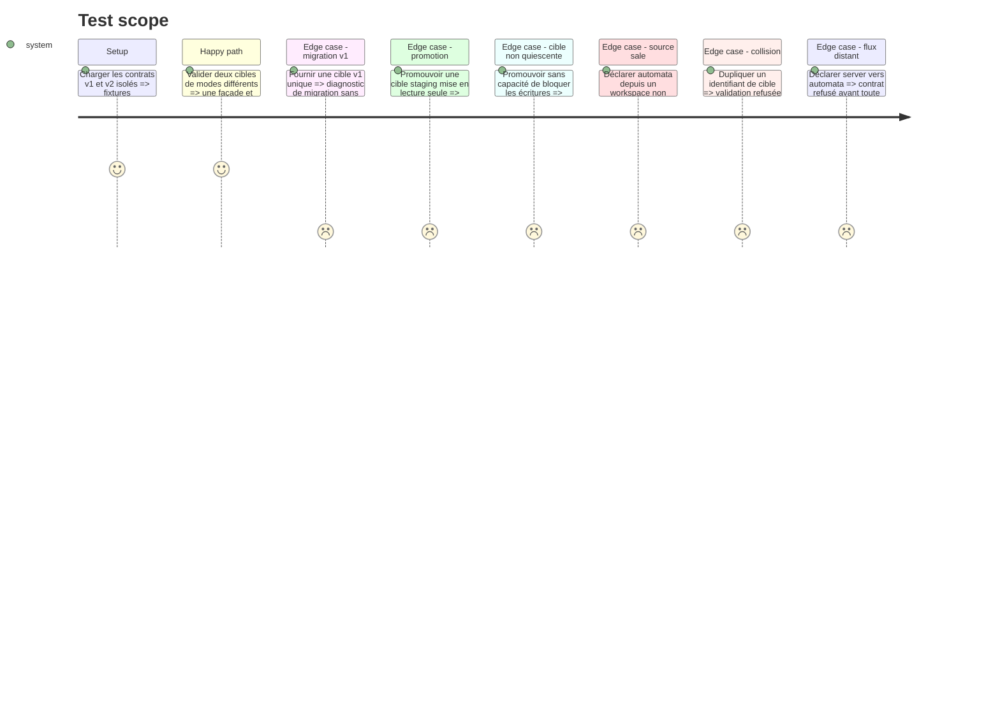

# Instruction: Établir le contrat projet v2 multi-cibles

## Architecture projection

> Tree of the final files. ✅ create · ✏️ modify · ❌ delete

```txt
tools
├── sc-cd
│   ├── contract.md                                  ✏️ phases, cibles, surfaces et sens autorisé
│   ├── project-contract.schema.json                 ✏️ schéma v2 multi-cibles
│   ├── validate-project-contract.mjs                ✏️ validation v2 et diagnostic v1
│   └── sync-contract.mjs                            ✏️ distribution des références v2
└── eval
    ├── sc-cd.mjs                                    ✏️ invariants et migration
    └── fixtures-sc-cd
        ├── valid-multi-target/deploy/contract.json  ✅ server et automata indépendants
        ├── valid-staging/deploy/contract.json       ✅ autorité locale par surface
        ├── valid-production/deploy/contract.json    ✅ données distantes protégées
        ├── valid-promotion/deploy/contract.json     ✅ bascule fail-closed d'une cible
        ├── promotion-failpoints/                    ✅ récupération à chaque coupure
        ├── legacy-v1/deploy/contract.json           ✅ migration contrôlée
        ├── invalid-duplicate-target/deploy/contract.json ✅ identifiant dupliqué refusé
        ├── invalid-dirty-automata/deploy/contract.json ✅ source non reproductible refusée
        ├── invalid-stale-lifecycle/deploy/contract.json ✅ ancienne enveloppe refusée
        └── invalid-remote-flow/deploy/contract.json ✅ relation distante refusée
plugins/sc-{css,js,php,python,rust,tiers}/references
├── cd-contract.md                                   ✏️ copies générées du contrat v2
└── cd-project-contract.schema.json                  ✏️ copies générées du schéma v2
❌ aucun fichier supprimé
```

## User Journey



## Test Scope



## Tasks to do

### `1)` Définir la forme v2

> Rendre explicites les cibles et les politiques que la v1 gardait globales.

1. Remplacer la cible unique par une collection non vide d'identifiants uniques portant phase, mode, fournisseur, déclencheur et noms de secrets.
2. Conserver un propriétaire racine et une façade unique ; déclarer pour chaque cible l'invocation exacte et les opérations qu'elle autorise.
3. Distinguer la source logique versionnée, le contexte d'exécution `workspace` ou `automation-checkout`, et la cible mutée ; exiger que tout checkout corresponde au dépôt et au ref annoncés.
4. Réserver automata à un commit propre et reproductible ; n'autoriser un workspace sale en server qu'avec une politique explicite, une confirmation et un manifeste de source qui rend l'écart observable.
5. Ajouter à chaque cible une phase et une révision de cycle de vie, la garde distante non secrète que toute mutation doit relire et la stratégie de quiescence requise pour une promotion sur place.
6. Décrire chaque opération par surface, autorité, préconditions, preuve, récupération, verrou et politique de mutation.
7. Exclure du modèle toute cible utilisée comme source, relation de réplication ou commande `pull:*`.

### `2)` Valider les invariants de sûreté

> Refuser les contrats capables d'écraser une production ou de dupliquer la procédure.

1. Imposer local comme autorité du code et du schéma sur toutes les phases.
2. Imposer local comme autorité des données et médias en staging, et la cible comme autorité de ces surfaces en production.
3. Vérifier que `server` et `automata` reprennent la même façade, les mêmes arguments de cible et le même code de sortie.
4. Exiger un verrou par cible pour toute mutation et interdire les secrets en clair.
5. Définir la promotion comme une séquence fail-closed : verrou de livraison, lecture seule applicative vérifiée, sauvegarde, dernier diff et preuve, confirmation, incrément de la garde distante vers production, mise à jour du contrat, régénération des enveloppes, sortie de lecture seule, puis déverrouillage.
6. Refuser la génération ou l'exécution automata quand la source ne désigne pas un commit propre matérialisable par le checkout.
7. Faire refuser toute mutation dont la phase ou la révision attendue diffère de la garde courante de la cible.
8. Définir une récupération idempotente pour chaque coupure ; après bascule de la garde, aucune récupération ne peut réautoriser une opération staging ancienne.

### `3)` Encadrer la migration v1

> Préserver les projets déjà configurés sans leur attribuer une politique destructive implicite.

1. Détecter la v1 et produire un diagnostic lisible plutôt qu'une erreur générique.
2. Reprendre propriétaire, commande, répertoire, fournisseur et opérations existants, mais demander l'identifiant et la phase manquants avant d'écrire la v2.
3. Tester la migration puis la seconde réconciliation sans diff.
4. Régénérer les douze copies portables à partir des deux sources canoniques.

## Test acceptance criteria

| Task | Acceptance criteria |
| ---- | ------------------- |
| 1 | Un contrat v2 valide porte plusieurs cibles nommées et une seule façade ; un checkout d'automate doit prouver la même source et aucune cible ne peut alimenter une autre cible. |
| 2 | Une promotion sans quiescence est refusée ; chaque coupure reste récupérable en état fermé et la garde distante fait échouer toute enveloppe staging antérieure. |
| 3 | Un contrat v1 reçoit une migration explicite, conserve ses faits connus, n'invente ni phase ni identifiant et devient idempotent après décision. |
