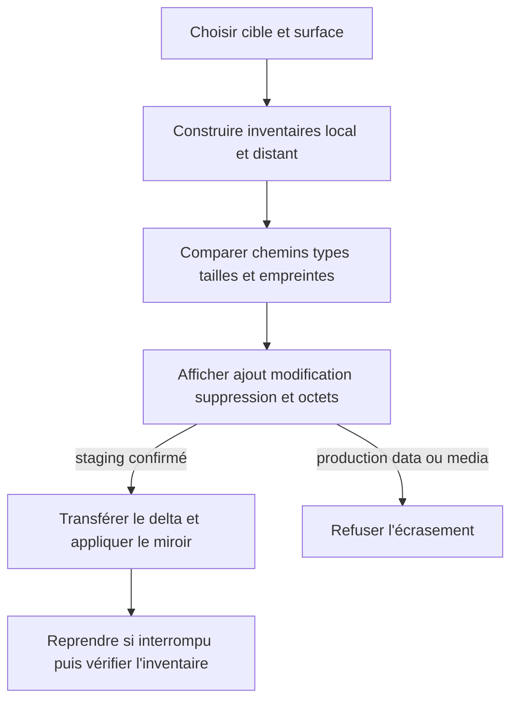
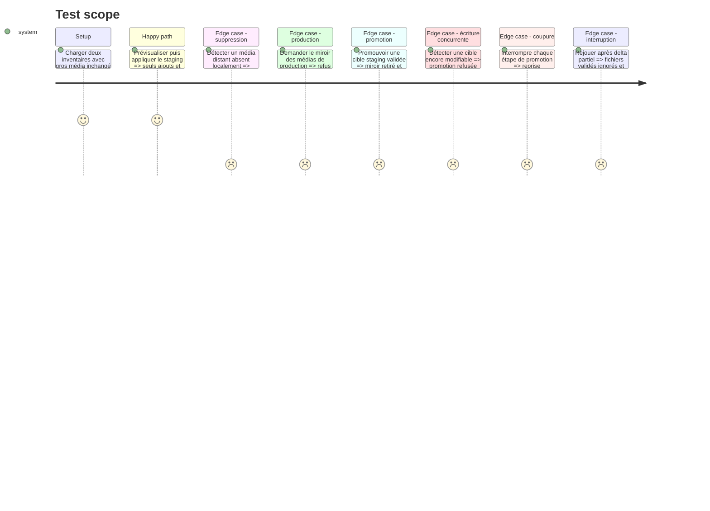

# Instruction: Définir la synchronisation différentielle des surfaces persistantes

## Architecture projection

> Tree of the final files. ✅ create · ✏️ modify · ❌ delete

```txt
tools/sc-cd
├── differential-sync.md                             ✅ protocole canonique d'inventaire et de transfert
├── compare-manifests.mjs                            ✅ oracle de diff sans dépendance runtime
└── sync-contract.mjs                                ✏️ distribuer la nouvelle référence
plugins/sc-{css,js,php,python,rust,tiers}/references
└── cd-differential-sync.md                          ✅ copies générées portables
tools/eval
├── sc-cd.mjs                                        ✏️ garde du protocole et des copies
└── fixtures-sc-cd
    └── differential-sync
        ├── local-manifest.json                      ✅ inventaire source
        ├── remote-manifest.json                     ✅ inventaire cible
        ├── expected-staging-diff.json               ✅ ajouts changements suppressions
        └── expected-production-refusal.json         ✅ médias distants protégés
❌ aucun fichier supprimé
```

## User Journey



## Test Scope



## Tasks to do

### `1)` Normaliser les inventaires

> Comparer le contenu sans dépendre d'un fournisseur ou d'une stack.

1. Définir chemins relatifs normalisés, type, taille, empreinte de contenu et exclusions par surface.
2. Refuser chemins absolus, traversées, liens non autorisés, collisions de casse et algorithmes d'empreinte incompatibles.
3. Classer les entrées en inchangées, ajoutées, modifiées et absentes de la source.
4. Afficher le volume total et le volume réellement transférable avant mutation.
5. Implémenter sous `tools/` un oracle sans dépendance qui calcule le diff attendu des fixtures, sans le distribuer aux projets non-JavaScript.

### `2)` Définir les politiques staging et production

> Faire du différentiel une optimisation sans affaiblir l'autorité des données.

1. En staging, autoriser le miroir local vers cible, suppressions comprises après aperçu stable et confirmation.
2. En production, interdire tout envoi ou suppression de `data` et `media`; permettre seulement code et migrations déclaratives.
3. Distinguer les médias utilisateurs des médias versionnés qui appartiennent à l'artefact de code.
4. Exiger une sauvegarde et une récupération observables avant toute opération destructive autorisée.
5. Lors d'une promotion, exiger une capacité prouvée de lecture seule ou de suspension des écritures ; sinon refuser la promotion sur place et demander une nouvelle cible.
6. Sous quiescence, exiger un dernier aperçu stable, une preuve saine et une sauvegarde fraîche, puis basculer d'abord la garde distante afin que tout ancien miroir échoue fermé.
7. Mettre ensuite à jour le contrat et ses autorités, régénérer les enveloppes liées à la nouvelle révision, vérifier le refus des anciennes, sortir de lecture seule, puis libérer le verrou.
8. Tester la reprise avant la garde, entre garde et contrat, et entre contrat et enveloppes ; toutes les reprises convergent sans baisse de révision.

### `3)` Profiler et reprendre le transport

> Exploiter la meilleure primitive prouvée sans renvoyer les fichiers inchangés.

1. Préférer rsync avec aperçu détaillé, empreinte de contenu, partiels et suppression gardée lorsque les deux extrémités le supportent.
2. Autoriser un fallback manifeste plus transfert fichier par fichier seulement s'il compare les empreintes et saute les contenus identiques.
3. Refuser la synchronisation si la cible ne peut ni produire un inventaire fiable ni prouver l'intégrité après transfert.
4. Écrire via temporaire puis renommage, conserver les partiels sûrs et revérifier l'inventaire final.

## Test acceptance criteria

| Task | Acceptance criteria |
| ---- | ------------------- |
| 1 | L'oracle calcule un diff déterministe depuis deux inventaires ; un fichier volumineux de même empreinte compte zéro octet transférable et une seconde passe est vide. |
| 2 | Le staging peut devenir un miroir ; sa promotion sous quiescence protège données et médias, tandis qu'une cible non quiescente est refusée sur place. |
| 3 | Une interruption ne retransmet pas les fichiers déjà vérifiés ; l'absence de comparaison fiable arrête l'opération au lieu de revenir à une archive complète. |
