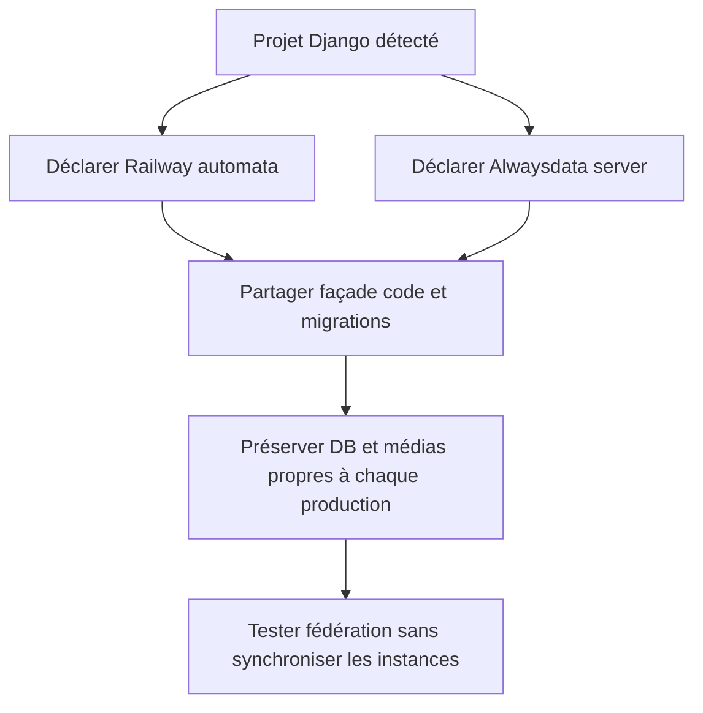
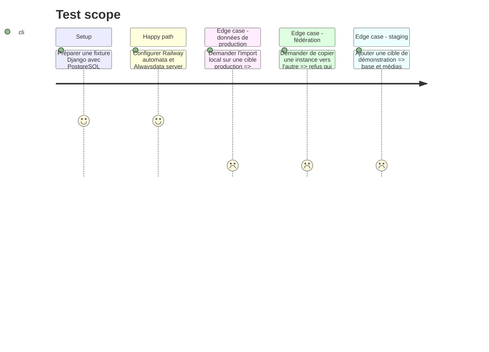

# Instruction: Éprouver sc-python sur plusieurs instances indépendantes

## Architecture projection

> Tree of the final files. ✅ create · ✏️ modify · ❌ delete

```txt
plugins/sc-python/skills/cd
├── SKILL.md                                          ✏️ routage cible et phase
├── actions
│   ├── 02-server.md                                 ✏️ sélection d'une cible server
│   └── 03-automata.md                               ✏️ délégation d'une cible automata
├── references
│   ├── command-facade.md                            ✏️ invocations multi-cibles
│   ├── python-frameworks.md                         ✏️ stockage persistant par framework
│   └── sql-delivery.md                              ✏️ schéma contre données autoritaires
└── evals
    ├── scenarios.json                               ✏️ staging, production et cible nommée
    ├── delivery-scenarios.md                        ✏️ topologies Python
    └── delivery-safety-scenarios.md                 ✏️ protection DB et médias
tools/eval/fixtures-sc-cd/behave-park/fixture.yaml    ✏️ cas Django fédéré Railway et Alwaysdata
❌ aucun fichier supprimé
```

## User Journey



## Test Scope



## Tasks to do

### `1)` Adapter la façade Python aux cibles nommées

> Conserver le gestionnaire détecté et une seule implémentation de livraison.

1. Faire sélectionner explicitement cible et opération par la façade existante sans créer un script par fournisseur.
2. Déclarer commandes, répertoire, processus, migrations et health-check par cible.
3. Conserver le même appel natif lorsque le mode d'une cible passe de server à automata.
4. Verrouiller séparément chaque cible et propager tous les échecs.

### `2)` Séparer schéma, données et médias Python

> Autoriser les migrations sans transformer la base locale en source de production.

1. Traiter les migrations Django, Alembic ou équivalentes comme surface `schema` locale.
2. Traiter lignes métier, contenu éditorial et fichiers gérés par le stockage comme surfaces distantes en production.
3. Appliquer le miroir différentiel à une cible staging lorsque son stockage fichier est inventoriable.
4. Refuser d'annoncer une synchronisation média pour S3, R2 ou un volume sans stratégie de liste, empreinte et reprise prouvée.

### `3)` Modéliser le cas Suddenly

> Prouver la topologie qui a motivé le besoin sans contacter ses instances.

1. Ajouter une fixture Django propriétaire sc-python avec cible principale Railway automata et cible Alwaysdata server.
2. Représenter Railway comme checkout automatisé du ref déclaré et Alwaysdata comme invocation locale via SSH d'un script distant existant après mise à jour vérifiée du même ref.
3. Déclarer PostgreSQL, migrations, média local ou objet, health-check et redémarrage comme faits séparés.
4. Vérifier que les deux cibles reçoivent le même code versionné mais ne partagent ni base ni média.
5. Ajouter une troisième cible staging et prouver que sa politique de miroir n'affecte aucune production.

## Test acceptance criteria

| Task | Acceptance criteria |
| ---- | ------------------- |
| 1 | Deux cibles Python de modes différents appellent la même façade, sélectionnent leur propre invocation et se verrouillent indépendamment. |
| 2 | Les migrations de production restent possibles sans copie de données ; les médias ne sont synchronisés que sur une cible staging dotée d'une stratégie prouvée. |
| 3 | La fixture Suddenly-like reflète le checkout Railway et le script Alwaysdata existant, comporte un staging et ne crée aucun flux entre cibles ni accès réseau pendant les tests. |
