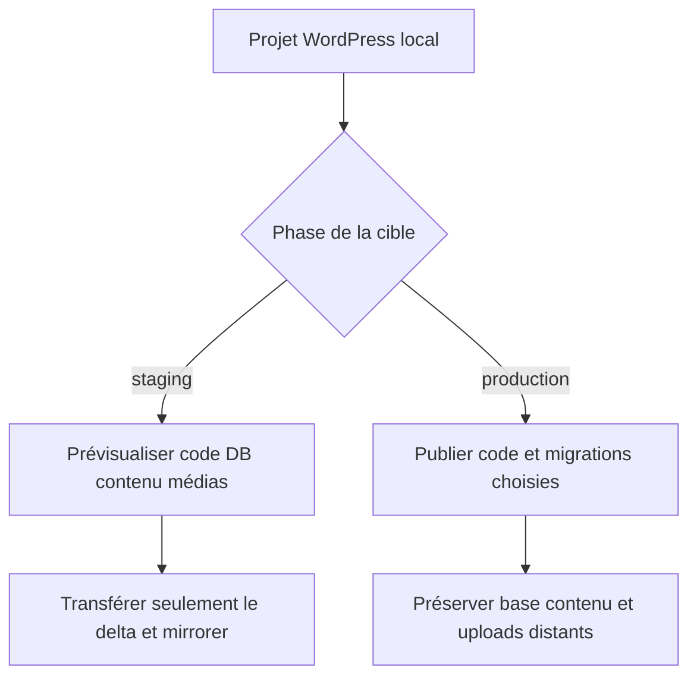
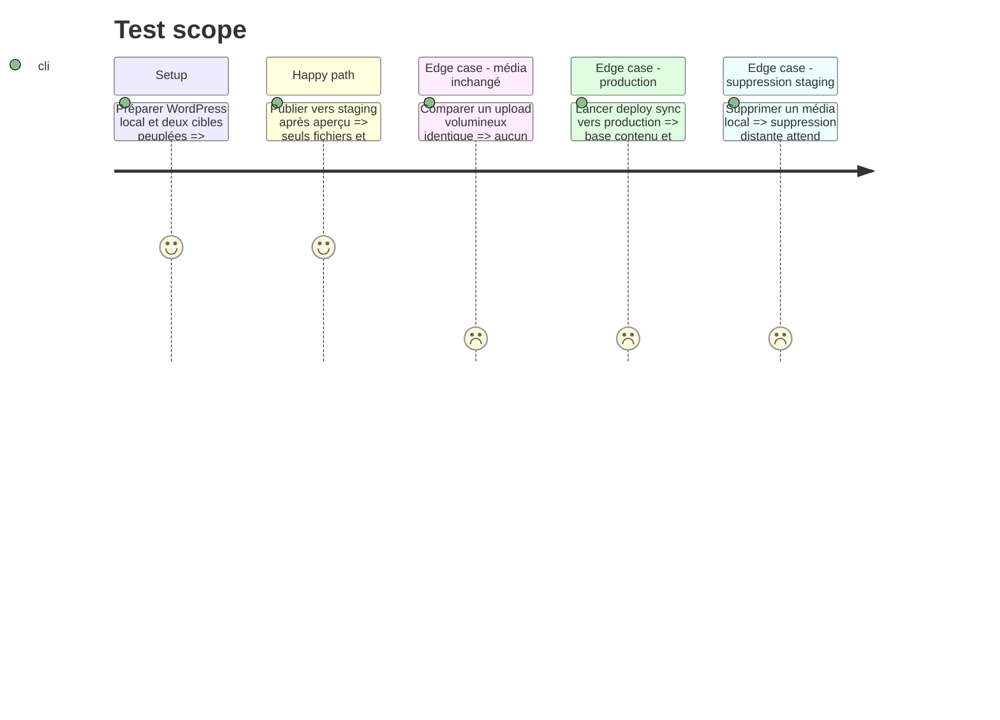

# Instruction: Rendre WordPress différentiel selon la phase de la cible

## Architecture projection

> Tree of the final files. ✅ create · ✏️ modify · ❌ delete

```txt
plugins/sc-php/skills/cd
├── SKILL.md                                          ✏️ cible et phase explicites
├── actions
│   ├── 02-server.md                                 ✏️ politiques code DB contenu média
│   └── 03-automata.md                               ✏️ opérations sûres par cible
├── references
│   ├── command-facade.md                            ✏️ façade multi-cibles
│   ├── php-frameworks.md                            ✏️ surfaces persistantes
│   └── wordpress-sync.md                            ✏️ miroir staging et production protégée
└── evals
    ├── scenarios.json                               ✏️ prompts de phase et cible
    ├── delivery-scenarios.md                        ✏️ comparaison différentielle
    └── delivery-safety-scenarios.md                 ✏️ suppressions et autorité
tools/eval/fixtures-sc-cd/behave-park/fixture.yaml    ✏️ variantes WordPress staging et production
❌ aucun fichier supprimé
```

## User Journey



## Test Scope



## Tasks to do

### `1)` Appliquer l'autorité par surface

> Remplacer le comportement WordPress global par des décisions liées à la cible.

1. Garder thème, plugins applicatifs, configuration déclarative et migrations sous autorité locale.
2. En staging, autoriser export/import de base et miroir des uploads depuis le local après sauvegarde, aperçu et confirmation.
3. En production, exclure base éditoriale, contenu et uploads de toute livraison locale.
4. Garder caches, logs, mises à niveau temporaires et secrets hors de toutes les surfaces.

### `2)` Rendre les médias réellement différentiels

> Supprimer le transfert récurrent du `wp-content` complet.

1. Inventorier le périmètre média déclaré et comparer les empreintes avant transfert.
2. Utiliser rsync lorsque prouvé, sinon le fallback manifeste sûr ; ne jamais revenir silencieusement à `tar | ssh` complet.
3. Produire un aperçu listant ajouts, changements, suppressions et octets avant toute écriture.
4. Reprendre les partiels, vérifier l'inventaire final et conserver la récupération déclarée.

### `3)` Préserver la façade et les contributions composites

> Garder PHP propriétaire sans absorber la logique JS ou fournisseur.

1. Réconcilier les anciennes commandes pnpm, PowerShell ou Composer derrière une seule implémentation.
2. Laisser JavaScript et CSS contribuer aux scopes du thème sans créer une autre façade.
3. Faire porter cible, phase et opération par le contrat et les arguments existants.
4. Déléguer uniquement l'enveloppe fournisseur à sc-tiers.

## Test acceptance criteria

| Task | Acceptance criteria |
| ---- | ------------------- |
| 1 | Le staging peut refléter base et médias locaux ; la production ne reçoit que code et migrations explicitement sûres. |
| 2 | Un média inchangé n'est pas retransmis, les suppressions staging sont prévisualisées et une cible sans inventaire fiable est refusée. |
| 3 | Un projet WordPress composite conserve une façade racine et plusieurs cibles sans dupliquer les procédures PHP, JS, CSS ou fournisseur. |
