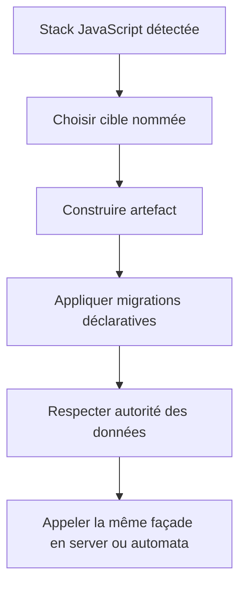
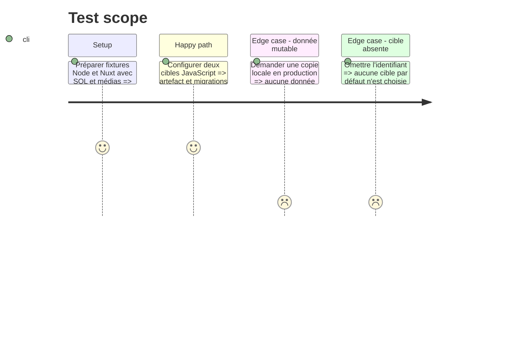

# Instruction: Adapter JavaScript au contrat v2

## Architecture projection

> Tree of the final files. ✅ create · ✏️ modify · ❌ delete

```txt
plugins
├── sc-js/skills/cd
│   ├── SKILL.md                                      ✏️ multi-cibles et phases
│   ├── actions/{02-server,03-automata}.md            ✏️ façade et délégation v2
│   ├── references/{command-facade,data-layers}.md    ✏️ surfaces SQL et médias
│   └── evals/{scenarios.json,delivery-scenarios.md,delivery-safety-scenarios.md} ✏️ preuves v2
└── tools/eval/fixtures-sc-cd/behave-park/fixture.yaml ✏️ variantes JavaScript
❌ aucun fichier supprimé
```

## User Journey



## Test Scope



## Tasks to do

### `1)` Adapter JavaScript

> Distinguer migrations, données serveur, IndexedDB et médias persistants.

1. Sélectionner la cible dans la façade du gestionnaire déjà détecté.
2. Garder SQL schema local, contenu SQL distant en production et migrations IndexedDB dans la release de code.
3. Autoriser un miroir staging des données ou médias seulement lorsqu'une stratégie export/import ou inventaire existe.
4. Étendre les scénarios Nuxt, Node et statiques sans inventer un stockage.

## Test acceptance criteria

| Task | Acceptance criteria |
| ---- | ------------------- |
| 1 | Une application JavaScript multi-cibles distingue code, schéma, données serveur et données navigateur sans inventer de copie de production. |
