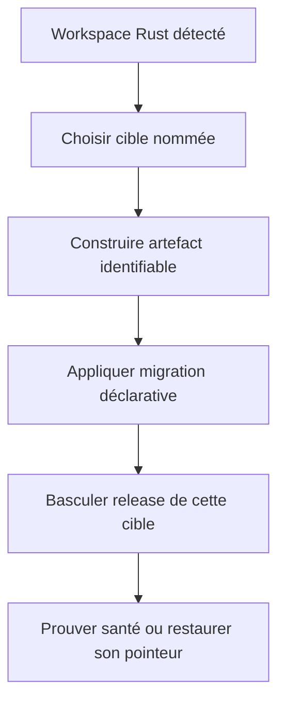
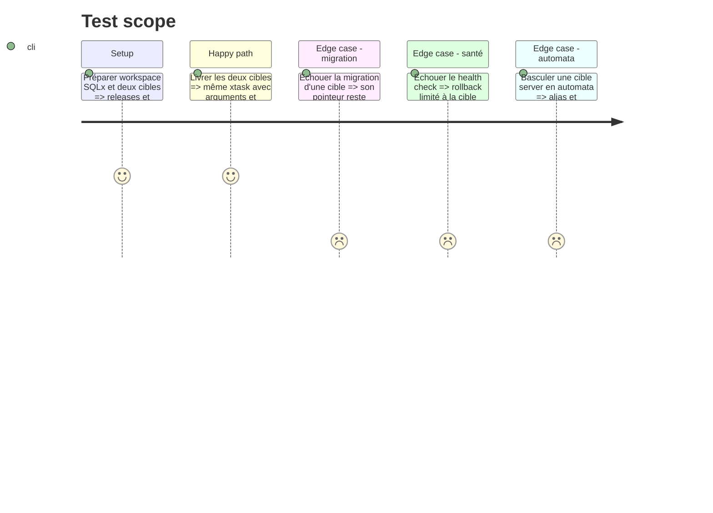

# Instruction: Adapter les releases Rust aux cibles indépendantes

## Architecture projection

> Tree of the final files. ✅ create · ✏️ modify · ❌ delete

```txt
plugins/sc-rust/skills/cd
├── SKILL.md                                          ✏️ releases multi-cibles
├── actions/{02-server,03-automata}.md                ✏️ sélection et délégation de cible
├── references
│   ├── command-facade.md                            ✏️ invocations v2
│   ├── sql-delivery.md                              ✏️ schéma contre données
│   └── releases.md                                  ✏️ verrous et rollback par cible
└── evals
    ├── scenarios.json                               ✏️ phase mode et cible
    ├── delivery-scenarios.md                        ✏️ releases indépendantes
    └── delivery-safety-scenarios.md                 ✏️ échecs migration et santé
tools/eval/fixtures-sc-cd/behave-park/fixture.yaml    ✏️ variantes Rust multi-cibles
❌ aucun fichier supprimé
```

## User Journey



## Test Scope



## Tasks to do

### `1)` Attacher la release à la cible

> Empêcher le partage accidentel d'artefacts actifs ou de pointeurs.

1. Déclarer package, binaire, features, target, source et checksum par invocation de cible.
2. Conserver un alias ou xtask unique qui reçoit la cible explicitement.
3. Verrouiller répertoire, pointeur courant et rollback par cible.
4. Refuser toute cible ou compilation croisée non prouvée.

### `2)` Séparer schéma et données

> Autoriser les migrations sans déplacer les données de production.

1. Garder SQLx, Diesel ou la stratégie rusqlite comme surface schema locale.
2. Garder les données métier et fichiers persistants sous autorité de chaque production.
3. Autoriser leur miroir seulement pour une cible staging dont les opérations sont définies.
4. Stopper la bascule de release dès qu'une migration échoue.

### `3)` Conserver la réversibilité en automata

> Faire changer le contexte d'exécution, pas la procédure.

1. Faire reprendre textuellement alias, arguments de cible, preuve et récupération par l'enveloppe.
2. Propager les statuts de build, migration, bascule et santé.
3. Restaurer uniquement le pointeur de la cible défaillante.
4. Prouver l'indépendance des verrous sur deux cibles concurrentes.

## Test acceptance criteria

| Task | Acceptance criteria |
| ---- | ------------------- |
| 1 | Chaque cible Rust possède une release identifiable, un pointeur et un verrou sans seconde façade. |
| 2 | Une migration agit sur le schéma de la cible choisie et ne copie aucune donnée locale en production. |
| 3 | Server et automata utilisent le même xtask ; un échec et son rollback restent confinés à une cible. |

