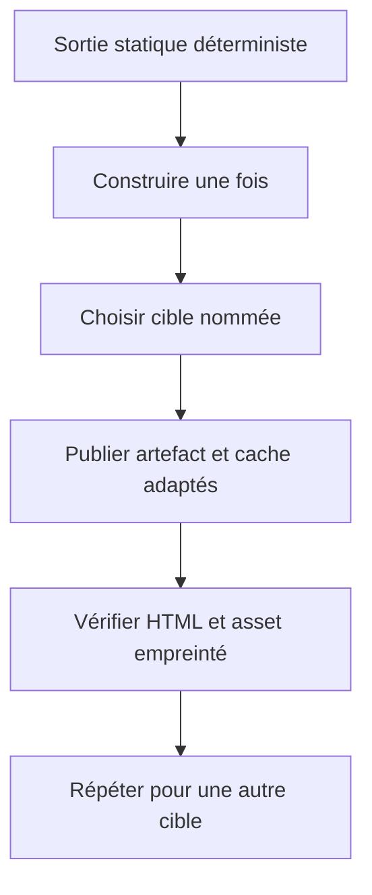
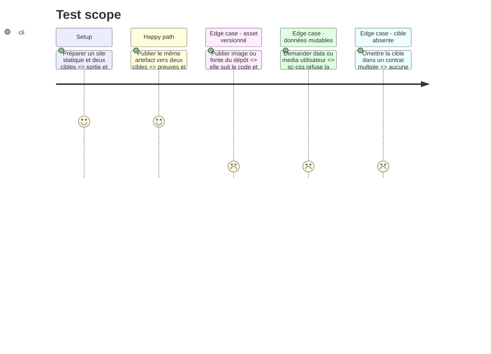

# Instruction: Publier les sites statiques vers plusieurs cibles

## Architecture projection

> Tree of the final files. ✅ create · ✏️ modify · ❌ delete

```txt
plugins/sc-css/skills/cd
├── SKILL.md                                          ✏️ sorties statiques multi-cibles
├── actions/{02-server,03-automata}.md                ✏️ sélection explicite
├── references/static-delivery.md                    ✏️ artefacts et médias versionnés
└── evals
    ├── scenarios.json                               ✏️ phase mode et cible
    ├── delivery-scenarios.md                        ✏️ sorties et caches
    └── delivery-safety-scenarios.md                 ✏️ propriété statique bornée
tools/eval/fixtures-sc-cd/behave-park/fixture.yaml    ✏️ variantes statiques multi-cibles
❌ aucun fichier supprimé
```

## User Journey



## Test Scope



## Tasks to do

### `1)` Étendre la façade statique

> Réutiliser une sortie déterministe sur plusieurs destinations.

1. Garder sc-css propriétaire seulement d'un projet purement statique.
2. Ajouter la cible explicite à l'invocation sans reconstruire une procédure par fournisseur.
3. Lier cache, preuve et récupération à chaque cible.
4. Conserver build, preview et sortie comme faits communs du projet.

### `2)` Classer correctement les fichiers

> Ne pas confondre assets versionnés et contenu utilisateur.

1. Traiter HTML, CSS, JavaScript, images et fontes versionnés comme surface code.
2. Ne déclarer aucune base, donnée mutable ou média utilisateur sous sc-css.
3. Rester contributeur borné lorsqu'un runtime applicatif possède la racine.
4. Refuser une sortie ou une politique de cache non prouvée.

### `3)` Déléguer les modes sans dérive

> Garder le même artefact et la même façade en server et automata.

1. Passer contrat, cible et invocation inchangés à sc-tiers.
2. Propager statut, preuve d'entrée et preuve d'asset empreinté.
3. Tester plusieurs cibles avec caches différents sans mélanger leurs métadonnées.
4. Rejouer la réconciliation et obtenir zéro diff.

## Test acceptance criteria

| Task | Acceptance criteria |
| ---- | ------------------- |
| 1 | Un artefact statique déterministe peut alimenter plusieurs cibles nommées avec preuves propres. |
| 2 | Les assets versionnés suivent le code ; les données et médias utilisateurs ne deviennent jamais propriété de sc-css. |
| 3 | Server et automata appellent la même façade et une seconde réconciliation ne modifie aucun fichier. |
