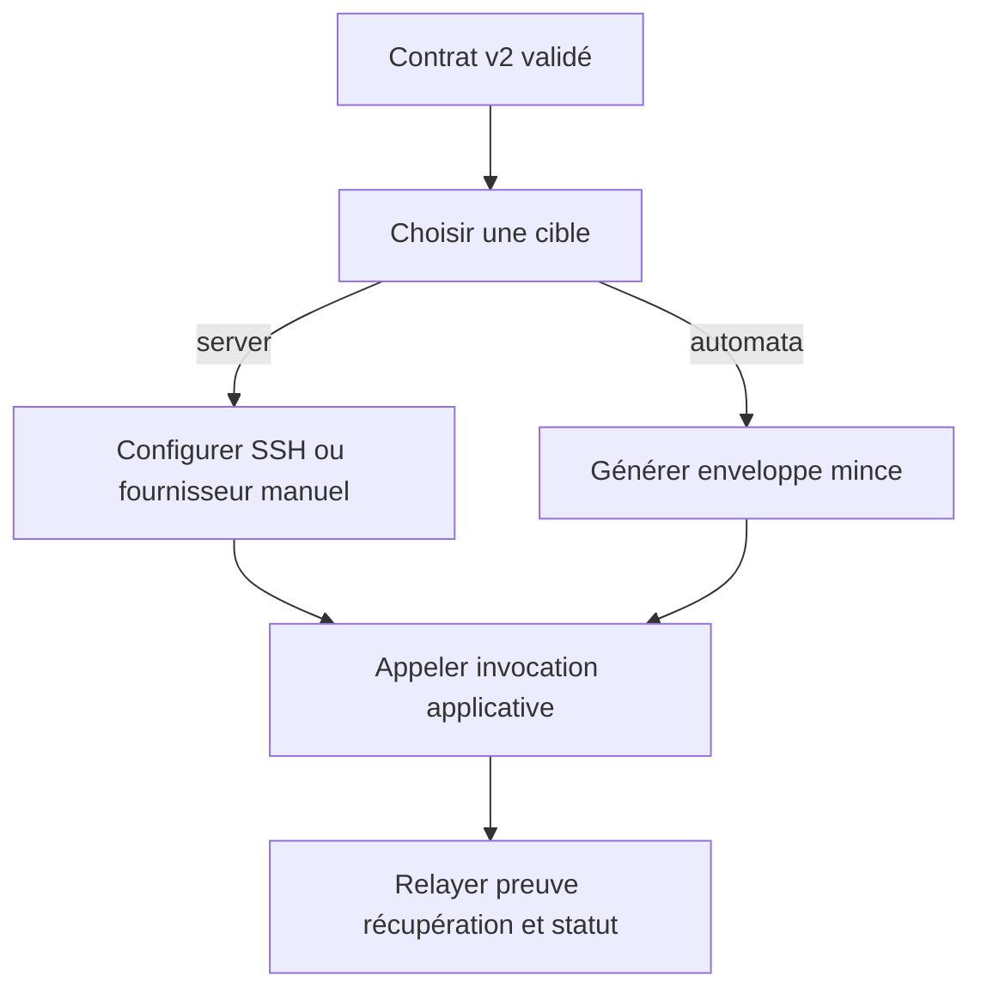
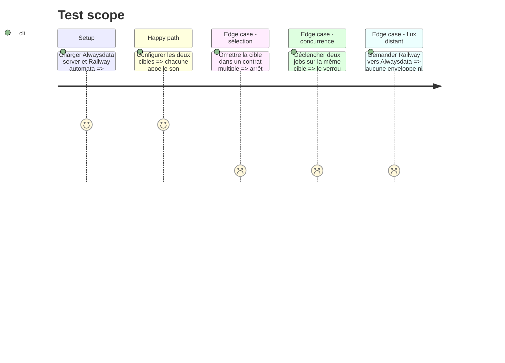

# Instruction: Configurer les fournisseurs et automates par cible

## Architecture projection

> Tree of the final files. ✅ create · ✏️ modify · ❌ delete

```txt
plugins/web-tiers/skills/cd
├── SKILL.md                                          ✏️ plusieurs cibles déclarées
├── actions/{02-server,03-automata}.md                ✏️ prérequis et enveloppes par cible
├── references
│   ├── providers.md                                 ✏️ SSH Alwaysdata Railway Heroku
│   └── ci-adapters.md                               ✏️ matrices et verrous par cible
└── evals
    ├── scenarios.json                               ✏️ sélection explicite
    ├── delivery-scenarios.md                        ✏️ multi-fournisseurs
    └── delivery-safety-scenarios.md                 ✏️ frontières et erreurs
tools/eval/fixtures-sc-cd/behave-park/fixture.yaml    ✏️ Alwaysdata server et Railway automata
❌ aucun fichier supprimé
```

## User Journey



## Test Scope



## Tasks to do

### `1)` Faire de la cible l'unité fournisseur

> Empêcher web-tiers de confondre les instances d'un projet.

1. Exiger un identifiant lorsque le contrat contient plusieurs cibles.
2. Lire mode, fournisseur, invocation, secrets, preuve, récupération, verrou, phase et révision de cette cible seulement.
3. Ne jamais agréger les données, médias ou chemins de deux cibles.
4. Conserver un état unsupported par cible sans dégrader les autres.

### `2)` Ajouter le profil Alwaysdata

> Couvrir le fournisseur observé sans absorber la procédure applicative.

1. Déclarer SSH/SFTP, absence de root, chemins, empreinte hôte et capacités rsync comme faits à vérifier.
2. Prévoir une garde distante non secrète de phase et révision, lisible au préflight et mise à jour sous verrou pendant la promotion.
3. Déclarer le redémarrage site ou service comme hook fournisseur facultatif après preuve applicative.
4. Ne stocker que les noms de token API, compte et identifiant non secret ; ne jamais contacter l'API pendant la configuration.
5. Signaler qu'un redémarrage Apache peut affecter plusieurs sites du compte et exiger une autorisation adaptée.

### `3)` Générer des automates minces multi-cibles

> Permettre server vers automata sans seconde implémentation.

1. Générer un job ou une matrice par cible automata avec son invocation exacte et le ref source attendu.
2. Embarquer la phase et la révision attendues et relire la garde courante avant toute mutation.
3. Refuser tout ref non résolu, workspace sale, manifeste non reproductible ou garde périmée avant de produire ou exécuter l'enveloppe.
4. Utiliser un groupe de concurrence par cible et propager le statut non nul.
5. Garder le déclenchement manuel par défaut et le push explicite par cible.
6. Exclure toute logique de build, migration, inventaire ou synchronisation des fichiers de fournisseur.

## Test acceptance criteria

| Task | Acceptance criteria |
| ---- | ------------------- |
| 1 | web-tiers configure une cible explicite, n'accède jamais aux surfaces d'une autre et isole les cibles unsupported. |
| 2 | Alwaysdata expose seulement ses prérequis SSH/API et son hook ; aucune logique applicative n'y est dupliquée. |
| 3 | Passer une cible de server à automata conserve l'invocation, exige un commit propre et une garde courante ; une enveloppe antérieure à la promotion échoue avant mutation. |
