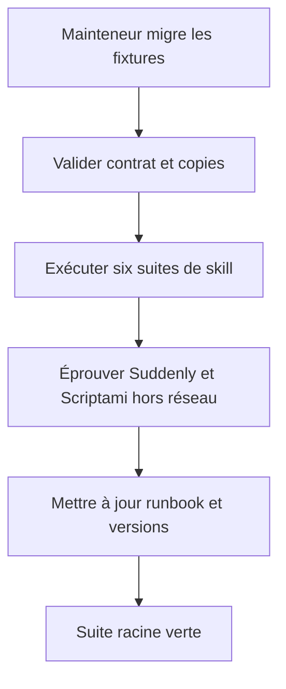
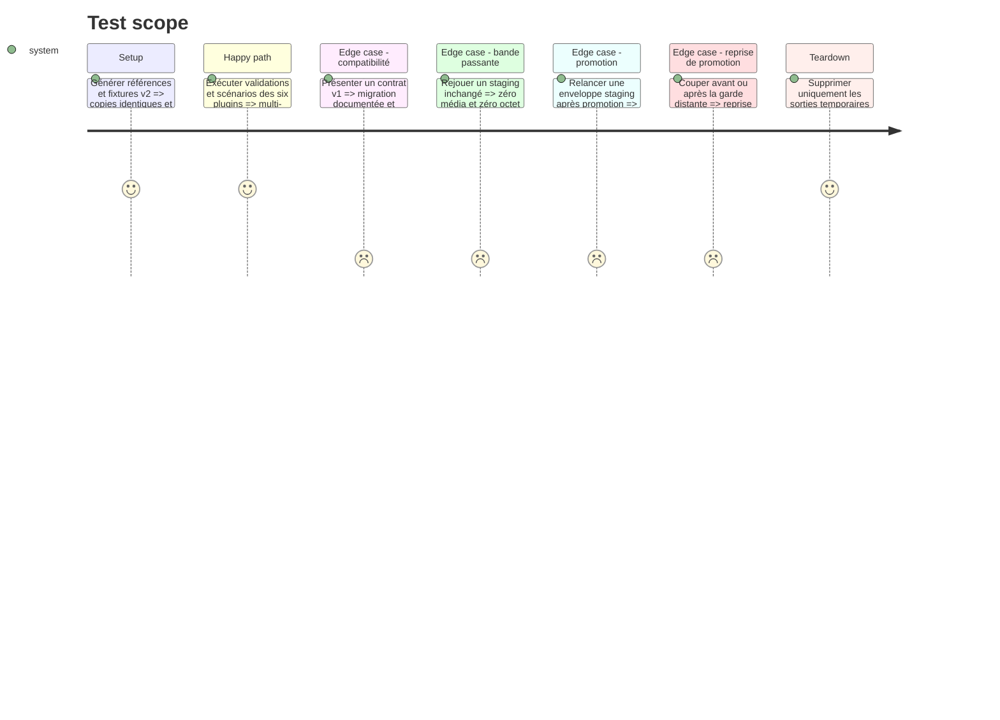

# Instruction: Valider, documenter et distribuer le contrat v2

## Architecture projection

> Tree of the final files. ✅ create · ✏️ modify · ❌ delete

```txt
.
├── README.md                                         ✏️ modèle CD multi-cibles
├── .claude-plugin/marketplace.json                   ✏️ versions et descriptions
├── tools/eval/sc-cd.mjs                              ✏️ suite intégrée finale
├── plugins/sc-{css,js,php,python,rust,tiers}
│   ├── .claude-plugin/plugin.json                    ✏️ version distribuée
│   ├── .codex-plugin/plugin.json                     ✏️ version et cachebuster
│   ├── README.md                                     ✏️ cibles phases surfaces limites
│   └── CHANGELOG.md                                  ✏️ contrat v2 et migration
└── aidd_docs/tasks/2026_08/2026_08_28-sc-cd-multicibles-staging-media
    └── migration-v1-v2.md                            ✅ guide de migration vérifié
C:\Users\fxgui\Documents\Code\Perso\DEPLOYMENT.md  ✏️ runbook transversal et pilotes réels
❌ aucun fichier supprimé
```

## User Journey



## Test Scope



## Tasks to do

### `1)` Consolider les preuves intégrées

> Faire des invariants du brainstorm des contrôles exécutables.

1. Étendre l'oracle de contrat aux cibles, phases, révisions et gardes distantes, quiescence, reprises de promotion, contextes d'exécution, autorités, verrous, migration et absence de flux distant.
2. Exécuter l'oracle de manifestes sur les cas inchangé, delta, suppression gardée, reprise et production refusée.
3. Couvrir les six routeurs avec prompts staging, production, server, automata et sélection de cible.
4. Prouver sur inventaires qu'une seconde synchronisation inchangée prévoit zéro transfert et zéro suppression.
5. Exécuter toutes les validations sans credential ni accès production.

### `2)` Mettre à jour le runbook et la migration

> Transformer la photographie actuelle en guide raccordé aux contrats projet.

1. Présenter `DEPLOYMENT.md` comme catalogue des cibles et règles opérateur, pas comme propriétaire des scripts.
2. Cartographier les projets vers propriétaire, cibles, phase, mode, fournisseur et surfaces.
3. Documenter Suddenly comme topologie fédérée indépendante et Scriptami comme preuve code/DB/médias.
4. Documenter la migration v1 vers v2 et la promotion fail-closed d'une cible staging, y compris la récupération après chaque arrêt intermédiaire.

### `3)` Versionner et publier cohérent

> Distribuer ensemble schéma, skills, références et documentation.

1. Appliquer les versions décidées aux six manifests et au catalogue Claude, avec cachebusters Codex cohérents.
2. Ajouter changelogs et capacités réelles aux README sans promettre de fournisseur ou stockage non éprouvé.
3. Régénérer les références canoniques puis vérifier leur identité octet par octet.
4. Lancer validateurs plugin, skill, SC-CD, cohérence, diff et suite racine.

## Test acceptance criteria

| Task | Acceptance criteria |
| ---- | ------------------- |
| 1 | Les suites prouvent multi-cibles, contexte workspace/automate, garde de cycle de vie, refus d'une enveloppe périmée, zéro flux distant, verrou et zéro retransfert média, hors réseau. |
| 2 | Le runbook décrit Suddenly et Scriptami avec le vocabulaire v2 et fournit une migration et une promotion sans ambiguïté. |
| 3 | Les six plugins publient le même contrat et schéma, des versions cohérentes et une suite racine entièrement verte. |
