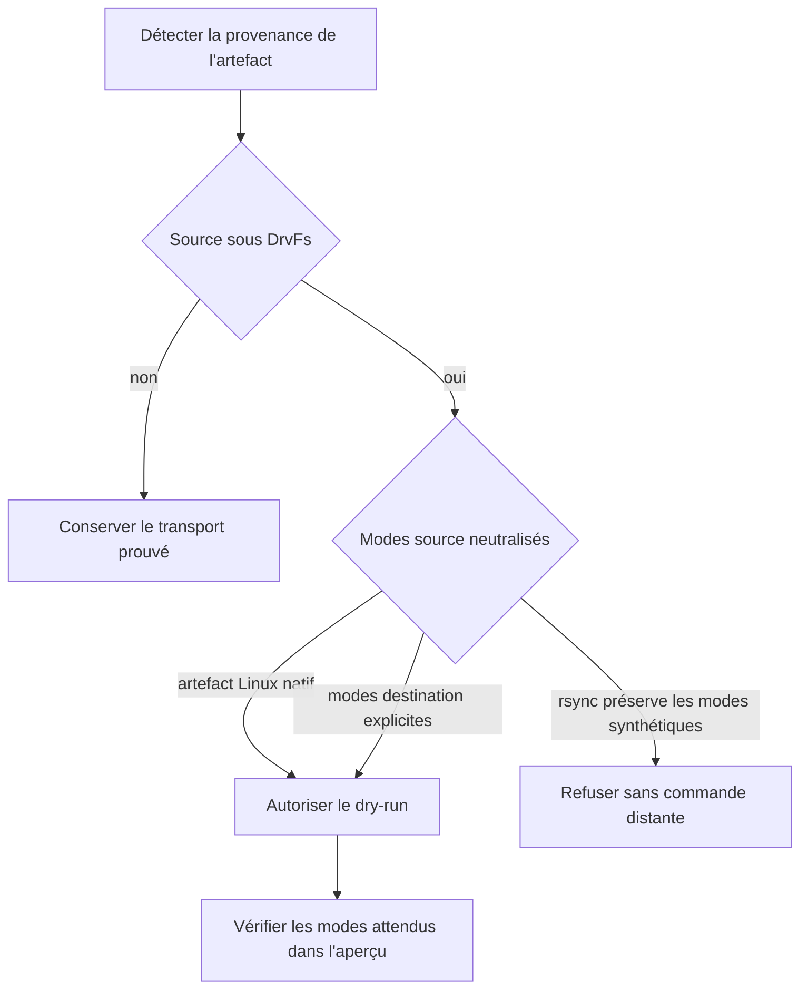
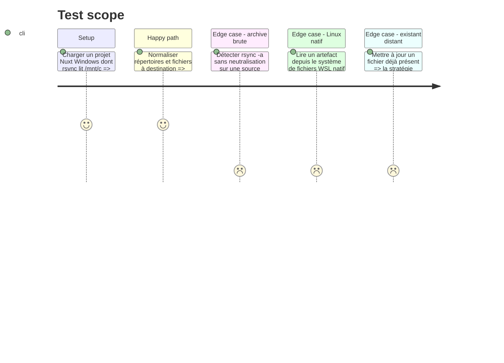

# Instruction: Neutraliser les permissions synthétiques aux frontières Windows/WSL

## Architecture projection

> Tree of the final files. ✅ create · ✏️ modify · ❌ delete

```txt
plugins/sc-js
├── references/host-portability.md                    ✏️ provenance DrvFs et frontière de permissions
└── skills/cd
    ├── actions/02-server.md                          ✏️ profil et vérification du transport
    ├── references/command-facade.md                  ✏️ invariants rsync et modes destination
    └── evals
        ├── delivery-scenarios.md                     ✏️ profils Windows/WSL et Linux natif
        └── delivery-safety-scenarios.md              ✏️ cas rouge rsync archive depuis /mnt
tools/eval
├── fixtures-sc-cd/behave-park/fixture.yaml           ✏️ fixture Nuxt DrvFs et variantes sûres
├── fixtures-sc-cd/js-delivery-evidence               ✅ profils dangereux et sûrs discriminants
│   ├── invalid-drvfs-archive.json                     ✅ modes DrvFs préservés
│   ├── valid-drvfs-normalized.json                    ✅ modes destination explicites
│   └── valid-linux-native.json                        ✅ artefact Linux natif
├── validate-js-delivery-evidence.mjs                  ✅ oracle déterministe sans dépendance
└── sc-cd.mjs                                          ✏️ exécution de l'oracle et couverture des invariants
❌ aucun fichier supprimé
```

## User Journey



## Test Scope



## Tasks to do

### `1)` Qualifier la provenance des modes

> Ne jamais traiter les bits visibles sous DrvFs comme une autorité Unix de production.

1. Traiter `/mnt/<lettre>` comme un signal DrvFs, sans en faire la seule preuve ni conclure que le mode vaut nécessairement `777`.
2. Exiger que le profil de transport établisse sa provenance à partir du chemin Windows converti et, selon ce qui est disponible, des informations de montage ou d'une déclaration de système de fichiers vérifiable ; distinguer DrvFs d'un artefact préparé dans un système de fichiers Linux natif.
3. Refuser la préservation des permissions, propriétaires et groupes DrvFs vers un hôte Linux.

### `2)` Exiger des modes destination observables

> Faire dépendre les permissions finales de la politique distante, pas de NTFS.

1. Autoriser un staging de l'artefact dans le système de fichiers WSL natif avant rsync.
2. Autoriser une normalisation rsync explicite qui conserve les propriétés réellement nécessaires mais applique des modes fichier/répertoire sûrs et ne tente pas de recopier owner/group.
3. Vérifier que la stratégie couvre les fichiers existants comme les nouveaux et ne se contente pas de l'umask de création.
4. Garder les valeurs de modes configurables lorsque le runtime exige un exécutable ; ne pas généraliser `F644` aux binaires prouvés.
5. Exiger un mécanisme de preuve post-transfert pour au moins un répertoire, un nouveau fichier et un fichier mis à jour ; distinguer sa déclaration hors réseau de son exécution lors d'une livraison réelle.

### `3)` Éprouver le refus hors réseau

> Reproduire le finding critique sans serveur ni credential.

1. Définir un profil JSON normalisé qui décrit la provenance du système de fichiers, la préservation des permissions/owner/group, les modes destination, les chemins exécutables déclarés et les preuves prévues.
2. Ajouter à `behave-park` une fixture Nuxt dont le chemin Windows devient `/mnt/c/...` et dont la commande historique préserve les modes.
3. Implémenter un oracle sans dépendance qui refuse un profil DrvFs préservant les modes et accepte soit un artefact Linux natif, soit une normalisation explicite.
4. Ajouter les trois fixtures discriminantes `invalid-drvfs-archive`, `valid-drvfs-normalized` et `valid-linux-native`, puis les exécuter depuis l'évaluation SC-CD.

## Test acceptance criteria

| Task | Acceptance criteria |
| ---- | ------------------- |
| 1 | Un profil dont la provenance DrvFS est établie ne peut pas fournir les permissions d'un artefact Linux ; `rsync -a` non neutralisé est refusé avant toute commande distante. |
| 2 | Une stratégie acceptée définit des modes destination explicites et un mécanisme de preuve pour répertoires, nouveaux fichiers et fichiers mis à jour, tout en permettant les exécutables réellement déclarés. |
| 3 | L'oracle exécuté par SC-CD distingue les trois fixtures DrvFS dangereuse, Linux native et normalisée sans accès réseau ni secret. |
