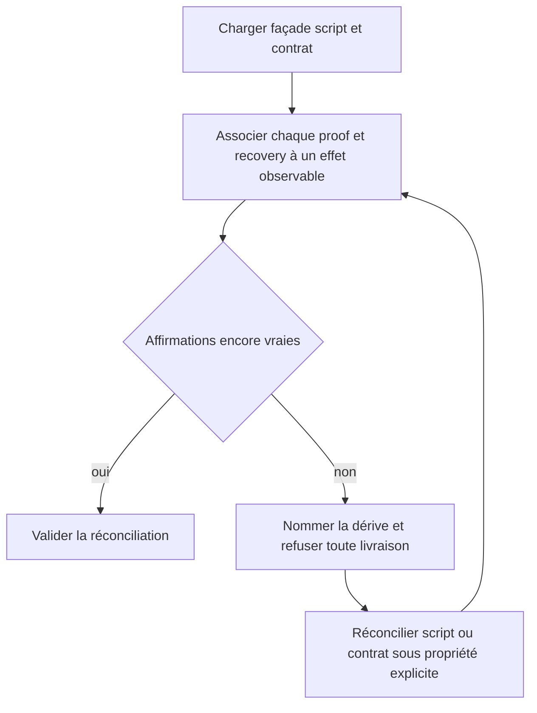
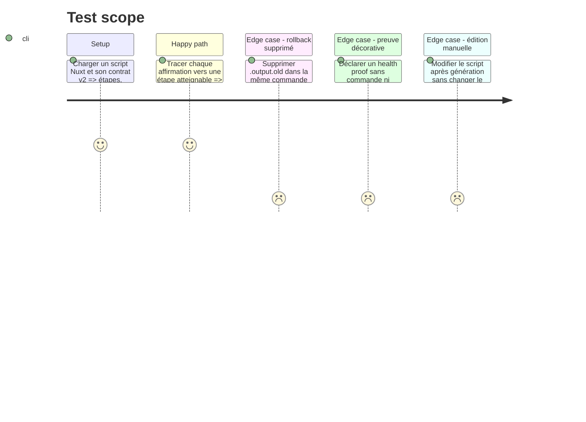

# Instruction: Vérifier la véracité comportementale de proof et recovery

## Architecture projection

> Tree of the final files. ✅ create · ✏️ modify · ❌ delete

```txt
plugins/sc-js/skills/cd
├── actions/02-server.md                              ✏️ contrôle comportemental au Verify
├── references/command-facade.md                      ✏️ correspondance contrat script et durée de récupération
└── evals
    ├── delivery-scenarios.md                         ✏️ preuve et récupération observables
    └── delivery-safety-scenarios.md                  ✏️ divergence .output.old reproduite
tools/eval
├── fixtures-sc-cd/behave-park/fixture.yaml           ✏️ script/contrat concordants et divergents
├── fixtures-sc-cd/js-delivery-evidence               ✅ traces comportementales discriminantes
│   ├── invalid-recovery-early-delete.json             ✅ rollback supprimé trop tôt
│   ├── invalid-proof-unbound.json                     ✅ preuve sans événement réel
│   └── valid-recovery-window.json                     ✅ rollback disponible sur sa fenêtre
├── validate-js-delivery-evidence.mjs                  ✏️ oracle des traces et fenêtres
└── sc-cd.mjs                                          ✏️ exécution des scénarios de dérive
❌ aucun fichier supprimé
```

## User Journey



## Test Scope



## Tasks to do

### `1)` Définir la parité comportementale

> Un texte de contrat n'est valide que si le script actuel permet de l'observer.

1. Faire relire au skill le script réellement présent sur disque à chaque réconciliation et lui faire produire une trace normalisée : événements ordonnés, chemins succès/échec, mutations, vérifications et nettoyages.
2. Exiger pour chaque `proof` la référence à un événement de cette trace, son résultat observable et la propagation de son échec.
3. Exiger pour chaque `recovery` l'artefact ou mécanisme concerné, une fenêtre de disponibilité explicite et les événements de création, préservation et éventuelle suppression.
4. Refuser les affirmations seulement nominales, les références absentes, les chemins inexistants et les récupérations supprimées avant la fin de leur fenêtre annoncée.
5. Limiter l'oracle à la validation déterministe de cette trace : il ne prétend pas analyser arbitrairement TypeScript ; c'est au skill d'inspecter le script et de justifier l'observation produite.

### `2)` Durcir l'étape Verify

> Vérifier la vérité, pas seulement la forme ou la présence des champs.

1. Étendre `02-server.md` pour tracer préconditions, preuve et récupération dans la façade et son script propriétaire.
2. Produire un no-write gap lorsqu'une affirmation ne peut pas être démontrée ; ne pas corriger silencieusement un script utilisateur divergent.
3. Maintenir les contrôles build, dry-run, commande/répertoire et idempotence existants.

### `3)` Reproduire la dérive cabinet-partage

> Garder rouge le cas qui supprimait le rollback après succès.

1. Étendre l'oracle avec les affirmations liées aux identifiants d'événement et les fenêtres de disponibilité.
2. Ajouter une fixture où le contrat conserve `.output.old` mais où sa trace le supprime dans le chemin de succès avant la fin de la fenêtre.
3. Ajouter une fixture où une preuve ne référence aucun événement réel et un contrôle positif où l'ancienne release reste sélectionnable pendant la fenêtre déclarée.
4. Faire exécuter ces fixtures par l'évaluation SC-CD afin qu'aucune variante divergente ne devienne verte par simple présence des chaînes `proof` et `recovery`.

## Test acceptance criteria

| Task | Acceptance criteria |
| ---- | ------------------- |
| 1 | Chaque preuve et récupération acceptée se rattache, dans l'observation normalisée du script actuel, à des événements atteignables et observables avec une fenêtre cohérente. |
| 2 | Une modification manuelle qui rend le contrat faux arrête la réconciliation avant toute livraison et nomme l'affirmation divergente. |
| 3 | L'oracle rejette la suppression anticipée de `.output.old` et la preuve sans événement lié, tandis que le contrôle positif conserve le rollback pendant toute sa fenêtre. |
