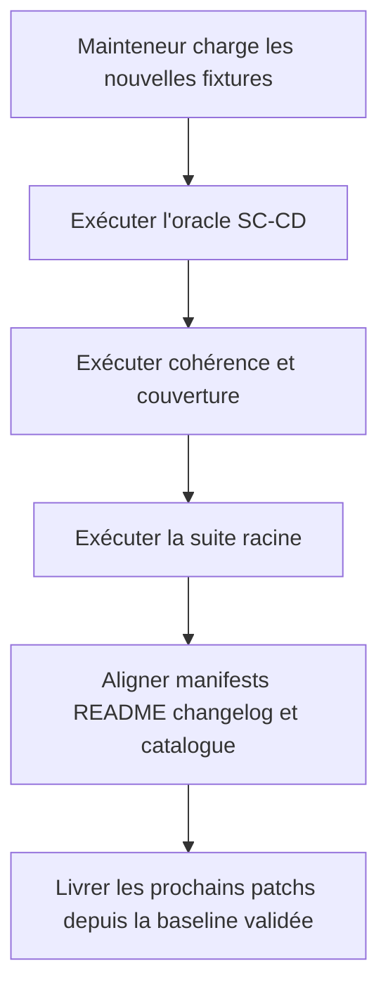
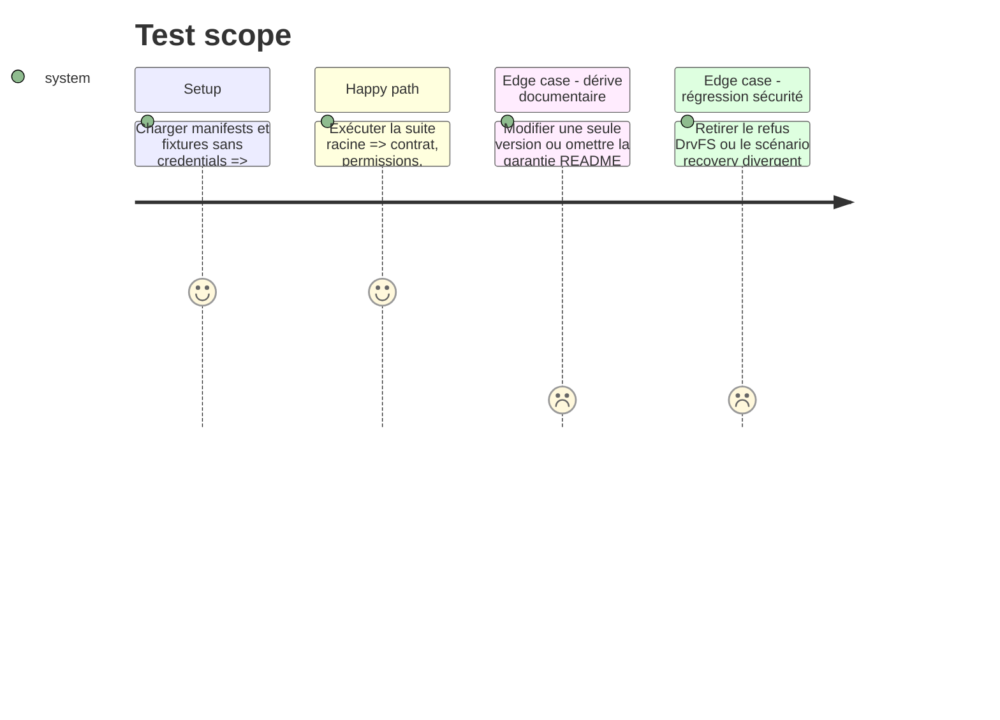

# Instruction: Distribuer et valider le correctif sc-js

## Architecture projection

> Tree of the final files. ✅ create · ✏️ modify · ❌ delete

```txt
.
├── .claude-plugin/marketplace.json                   ✏️ version catalogue et description sc-js
├── plugins/sc-js
│   ├── .claude-plugin/plugin.json                    ✏️ patch version Claude
│   ├── .codex-plugin/plugin.json                     ✏️ patch version et cachebuster Codex
│   ├── README.md                                     ✏️ garanties DrvFS et vérité du contrat
│   └── CHANGELOG.md                                  ✏️ retour terrain et migration comportementale
└── tools/eval/sc-cd.mjs                              ✏️ versions attendues et validation intégrée finale
❌ aucun fichier supprimé
```

## User Journey



## Test Scope



## Tasks to do

### `1)` Publier la capacité réelle

> Versionner le changement de comportement sans promettre plus que les gardes implémentées.

1. Vérifier juste avant implémentation que la baseline est toujours `sc-js 0.17.0` et marketplace `3.19.0` ; si elle a avancé, recalculer les prochains patchs et mettre le plan à jour avant toute modification.
2. Depuis cette baseline validée, passer `sc-js` à `0.17.1` dans les manifests Claude, Codex et le catalogue.
3. Renouveler le cachebuster Codex et passer le marketplace à `3.19.1`.
4. Documenter dans README et CHANGELOG le refus des permissions DrvFS préservées et la parité comportementale du contrat.
5. Mettre à jour les versions attendues par l'oracle intégré.

### `2)` Rejouer les gardes de distribution

> Fermer l'issue sur des preuves locales reproductibles.

1. Vérifier les scénarios DrvFS dangereux, normalisation sûre, Linux natif, récupération divergente et contrôle positif.
2. Exécuter l'oracle SC-CD, la cohérence des manifests, la couverture de routage et la suite racine complète.
3. Vérifier un diff propre, aucun credential et aucune tentative d'accès à une cible réelle.

## Test acceptance criteria

| Task | Acceptance criteria |
| ---- | ------------------- |
| 1 | Après validation de la baseline (ou replanification si elle a avancé), les deux manifests sc-js, le catalogue, le cachebuster, README et CHANGELOG décrivent tous le même prochain patch ; le marketplace annonce son patch correspondant. |
| 2 | La suite racine prouve hors réseau les deux correctifs de l'issue #18 et reste verte sur les autres plugins. |
