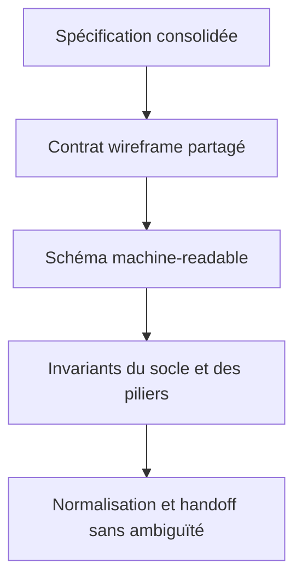
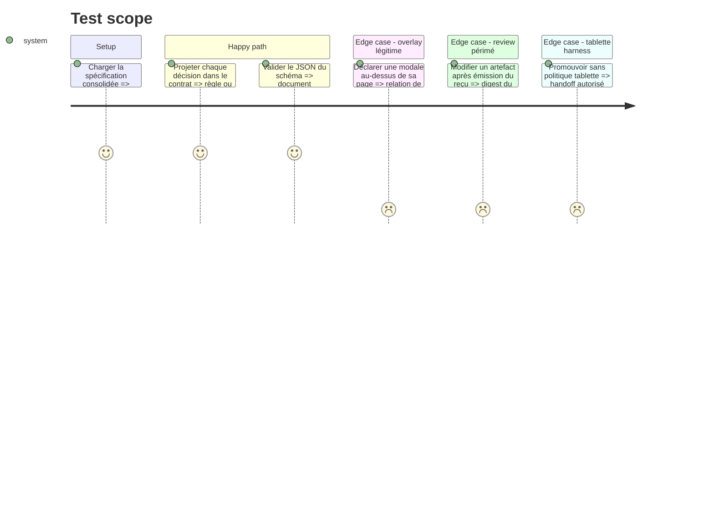

# Instruction: Fixer le contrat normatif et le schéma du manifeste

## Architecture projection

> Tree of the final files. ✅ create · ✏️ modify · ❌ delete

```txt
plugins/design/references/
├── wireframe-contract.md                            ✅ fixer format, socle, piliers et preuves
├── wireframe-manifest-schema.md                     ✅ expliquer les champs et invariants du manifeste
├── wireframe-manifest.schema.json                   ✅ fournir la forme machine-readable opposable
├── wireframe-review.schema.json                     ✅ définir le reçu détaché d’acceptation
├── wireframe-normalization.md                       ✅ fixer propriété, préservation et refus
└── wireframe-harness-handoff.md                     ✅ fixer acceptation, digest et frontière harness
```

## User Journey



## Test Scope



## Tasks to do

### `1)` Formaliser le manifeste

> Donner aux outils une source unique pour comparer des productions LLM.

1. Définir les unités `page|fragment|component`, éléments attendus, `primaryAction`, `initialState`, transitions entre états, contextes, piliers, références et métadonnées de page.
2. Ajouter les overlays autorisés comme relations explicites entre deux éléments dans un état donné ; tout autre recouvrement reste une erreur.
3. Garder l’acceptation hors du manifeste afin qu’elle ne modifie jamais les octets examinés.
4. Fermer le schéma aux champs inconnus et publier la même forme en JSON Schema et en explication humaine.

### `2)` Fixer format, socle et piliers

> Transformer chaque exigence de la spécification en règle statique, rendue ou humaine clairement attribuée.

1. Énoncer le shell autonome, les zones auteur, unités, états, deux largeurs et limites d’annotation.
2. Attribuer chaque critère au lint statique, au contrôle Chromium ou au review humain sans double conclusion.
3. Interdire toute ressource d’exécution ou d’affichage externe : scripts, styles, imports, polices, images et médias doivent être embarqués ; les liens de navigation restent permis.
4. Fixer les sorties publiques `0` valide, `1` violations, `2` invocation, entrée ou environnement inexploitable.

### `3)` Fixer normalisation, acceptation et handoff

> Rendre les transitions vérifiables avant d’écrire leurs outils.

1. Déclarer la source immuable, le shell neuf, l’inventaire de migration et les seuls arrêts sémantiques.
2. Ne requérir une décision humaine que lorsqu’une transformation changerait le sens, le parcours ou un contenu métier.
3. Définir un reçu détaché fermé portant `status = accepted|revoked`, reviewer, date, digest SHA-256 des octets HTML exacts et digests des deux rapports verts.
4. Exiger lint statique et rendu verts avant d’émettre le reçu ; un digest HTML différent ou un reçu révoqué bloque le handoff.
5. Exiger pour chaque état non initial une disposition harness `retained-interactive|reference-only|omitted|unresolved`, avec déclencheur lorsque l’état reste interactif et raison obligatoire pour `reference-only|omitted` ; `unresolved` bloque la migration.
6. Autoriser l’export d’un handoff avec tablette non résolue, mais interdire la création d’un harness canonique jusqu’au choix explicite `desktop-derived`, `mobile-derived` ou `defer`.

## Test acceptance criteria

| Task | Acceptance criteria |
| ---- | ------------------- |
| 1 | Le schéma du manifeste parse, refuse les champs inconnus et représente unités, état initial, transitions, overlays, provenance et métadonnées harness sans état de review embarqué. |
| 2 | Chaque exigence appartient à un niveau de preuve nommé ; une ressource réseau ou fichier annexe rend la planche non autonome. |
| 3 | Le reçu détaché lie reviewer, rapports verts et octets HTML ; le contrat distingue handoff exportable et harness constructible ; un reçu périmé ou une politique tablette absente interdit toute promotion complète. |
| 1–3 | Les six références ne déclarent aucune action publique ni outil inexistant ; `git diff --check` et `node tools/eval/consistency.mjs` restent verts. |
