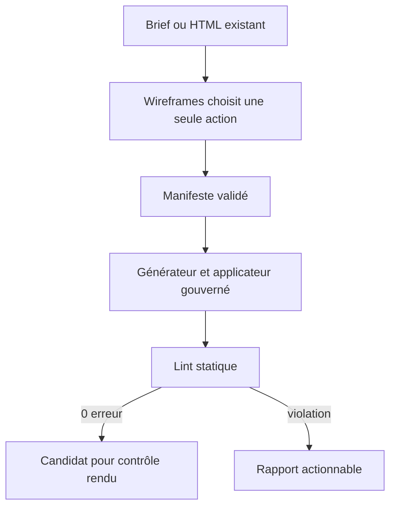
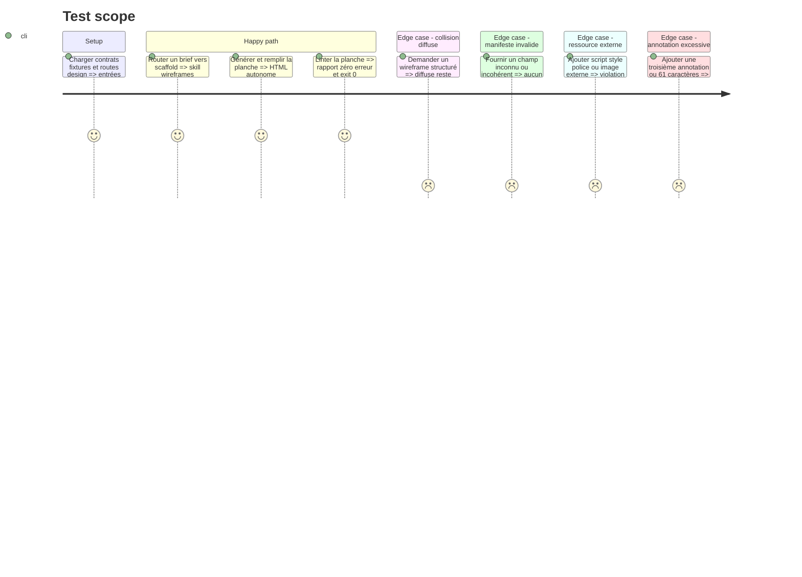

# Instruction: Livrer la skill, le shell canonique et le lint statique

## Architecture projection

> Tree of the final files. ✅ create · ✏️ modify · ❌ delete

```txt
plugins/design/
├── adapters/wireframes/
│   ├── wireframes.py                                 ✅ générer le shell autonome depuis un manifeste validé
│   └── fixtures/
│       ├── manifest-valid.json                       ✅ couvrir plusieurs unités et piliers
│       ├── manifest-invalid.json                     ✅ couvrir les erreurs de schéma
│       ├── payload-valid.json                        ✅ remplir les zones auteur sans toucher au shell
│       └── canonical.html                            ✅ fournir une sortie stable de référence
├── skills/
│   ├── diffuse/
│   │   ├── SKILL.md                                  ✏️ réserver le prototype aux composants et previews non gouvernés
│   │   ├── actions/00-prototype.md                   ✏️ retirer le wireframe structuré de ses entrées
│   │   └── evals/
│   │       ├── scenarios.json                        ✏️ router les demandes de wireframe ailleurs
│   │       └── routing-autonomy-scenarios.md         ✏️ prouver la nouvelle frontière
│   └── wireframes/
│       ├── SKILL.md                                  ✅ déclarer scaffold et lint avec leurs règles transversales
│       ├── actions/
│       │   ├── 01-scaffold.md                        ✅ générer depuis un brief et des références
│       │   └── 03-lint.md                            ✅ contrôler puis réparer les seuls défauts mécaniques
│       └── evals/
│           ├── scenarios.json                        ✅ couvrir les routes positives et négatives
│           └── routing-autonomy-scenarios.md         ✅ définir les observables comportementaux
└── tools/
    ├── wireframes-apply.py                           ✅ appliquer un payload revu dans les zones gouvernées
    ├── wireframes-lint.py                            ✅ contrôler manifeste, DOM et règles statiques
    └── wireframes-selftest.sh                        ✅ exercer les branches déterministes sans réseau
```

## User Journey



## Test Scope



## Tasks to do

### `1)` Enregistrer le premier parcours public sans collision

> Exposer seulement les intentions dont les outils existent à la fin de cette phase.

1. Router génération et lint/réparation mécanique vers `scaffold` et `lint` ; ne pas encore annoncer normalisation ou promotion.
2. Référencer les contrats partagés du plugin et les outils par chemins portables.
3. Imposer chemin de sortie explicite, source immuable, références lisibles et interdiction de déclarer une sortie non vérifiée valide.
4. Retirer `wireframe` de `diffuse` tout en y gardant les prototypes libres de composants et previews.
5. Ajouter aux deux skills des scénarios positifs et contre-cas symétriques, en gardant normalisation et promotion hors routes jusqu’à la phase 4.

### `2)` Générer un shell autonome déterministe

> Construire la planche commune sans demander au LLM d’en réinventer l’infrastructure.

1. Valider le manifeste avant toute écriture et refuser les clés, types, contextes ou liaisons incohérents.
2. Générer le doctype, le chrome minimal, le manifeste JSON embarqué, une section par unité et les cadres déclarés.
3. Réserver des zones auteur explicites pour le markup, les styles et les interactions d’aide.
4. Écrire atomiquement vers un chemin distinct et rendre une sortie octet-pour-octet stable à entrée identique.

### `3)` Appliquer le contenu auteur sans céder le shell

> Injecter les rendus préparés tout en conservant la propriété du manifeste et du chrome.

1. Accepter un payload JSON liant chaque unité et état à son HTML revu, plus les styles et interactions autorisés.
2. Refuser les unités inconnues, les états manquants, les fermetures de script/style et toute cible déjà remplie.
3. Échapper les chaînes, borner le JavaScript aux zones prévues et publier atomiquement le résultat.

### `4)` Implémenter le lint statique

> Rendre vérifiables le format commun, le socle et les seuls piliers actifs.

1. Parser le HTML et le manifeste avec la bibliothèque standard, sans regex de migration ni dépendance réseau.
2. Vérifier l’unicité des identifiants, l’accord manifeste/DOM, les unités, éléments, actions principales, états, overlays déclarés et contextes.
3. Appliquer les règles d’annotation, contenu, provenance et responsive qui ne demandent pas de moteur de rendu.
4. Refuser scripts et styles externes, `@import`, polices, images ou médias non embarqués ; ne pas confondre ces ressources avec un lien de navigation.
5. Émettre un rapport JSON stable avec erreurs, avertissements, règles applicables et codes 0/1/2.
6. Limiter `--fix` aux attributs et identifiants mécaniques reconstruisibles sans décision produit, puis rejouer le lint complet.

### `5)` Prouver le premier parcours vertical

> Verrouiller routage, générateur, applicateur et linter avec des contre-fixtures.

1. Tester la génération déterministe, l’atomicité, la source intacte et le refus d’écrasement.
2. Tester chaque type d’unité, chaque contexte et l’activation sélective des piliers.
3. Introduire volontairement des dérives de manifeste, DOM, ressources, annotations, contenu et provenance et attendre leurs identifiants d’erreur.

## Test acceptance criteria

| Task | Acceptance criteria |
| ---- | ------------------- |
| 1 | Chaque prompt scaffold/lint sélectionne exactement une action ; le wireframe structuré route vers `wireframes`, le prototype libre reste dans `diffuse`, et aucune route ne promet encore normalize/promote. |
| 2 | Deux générations du même manifeste sont identiques ; une entrée invalide écrit zéro sortie et nomme le champ fautif. |
| 3 | Le payload remplit uniquement les zones auteur, conserve le shell et refuse une seconde application destructive. |
| 4 | Une planche conforme sort en 0 ; une violation sort en 1 ; une invocation ou entrée inexploitable sort en 2 ; aucune ressource externe n’échappe au contrôle d’autonomie. |
| 5 | Le selftest couvre au moins une réussite et une contre-épreuve pour le format commun, le socle, chacun des quatre piliers et la frontière avec `diffuse`. |
| 1–5 | `node tools/eval/consistency.mjs` et le selftest statique rendent 0 ; aucune action publique ne pointe vers un outil absent. |
