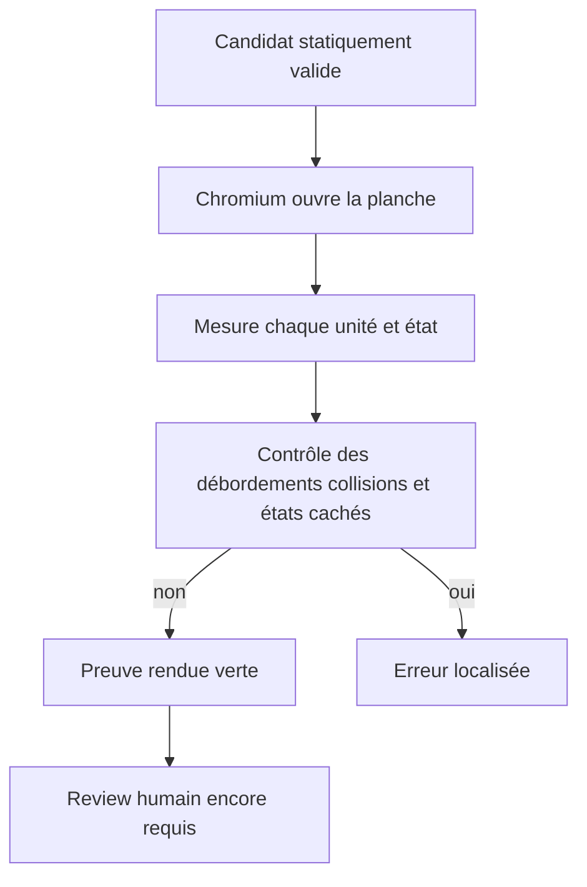
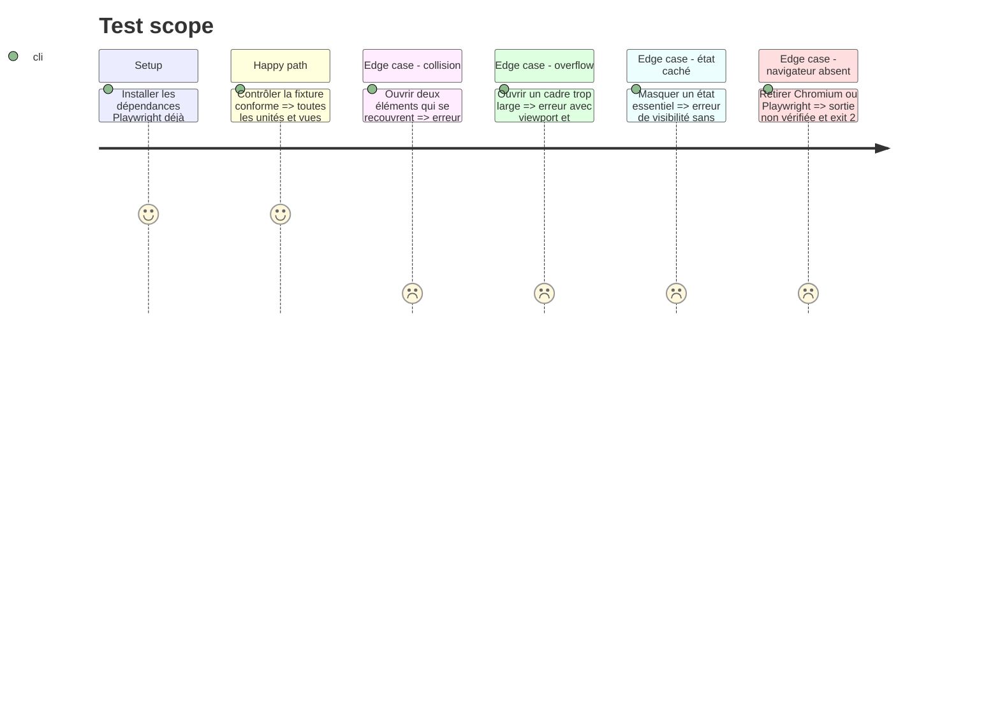

# Instruction: Vérifier la planche dans un vrai moteur de rendu

## Architecture projection

> Tree of the final files. ✅ create · ✏️ modify · ❌ delete

```txt
plugins/design/
├── adapters/wireframes/
│   ├── render-check.py                               ✅ mesurer visibilité, débordements et collisions dans Chromium
│   ├── fixtures/
│   │   ├── render-valid.html                         ✅ prouver mobile et desktop conformes
│   │   ├── render-overlap.html                       ✅ déclencher une collision non autorisée
│   │   ├── render-overflow.html                      ✅ déclencher une coupure ou un débordement
│   │   └── render-hidden-state.html                  ✅ détecter un état essentiel caché
│   └── tests/
│       ├── test_geometry.py                          ✅ tester les décisions géométriques sans navigateur
│       └── test_render_check.py                      ✅ tester les fixtures dans Chromium
├── references/wireframe-contract.md                  ✏️ préciser la preuve géométrique et les overlays permis
├── skills/wireframes/actions/03-lint.md              ✏️ exiger les deux niveaux de preuve
└── tools/wireframes-browser-selftest.sh              ✅ exécuter les contre-preuves Playwright
```

## User Journey



## Test Scope



## Tasks to do

### `1)` Séparer les preuves statiques, rendues et humaines

> Empêcher qu’un contrôle de structure prétende avoir vu la géométrie ou compris le brief.

1. Faire du lint statique une précondition du contrôle rendu.
2. Réutiliser la version Playwright déjà épinglée par l’adapter de mesure du plugin.
3. Refuser le statut valide si Chromium ne peut pas être lancé ; imprimer le prérequis actionnable.
4. Conserver l’acceptation humaine comme conclusion distincte et non dérivable.

### `2)` Mesurer les invariants visuels

> Contrôler ce que seul le layout calculé peut établir.

1. Charger le HTML local hors réseau et attendre la stabilisation des polices, animations et transitions.
2. Mesurer chaque unité, état et cadre déclaré à partir du manifeste.
3. Détecter coupures, débordement horizontal, éléments attendus invisibles et intersections absentes de `allowedOverlaps` pour l’unité et l’état mesurés ; comparer seulement les éléments déclarés d’un même niveau et exclure toute relation ancêtre/descendant.
4. Vérifier que les états essentiels sont visibles sans clic et que mobile/desktop utilisent exactement 390/1440.
5. Émettre un JSON déterministe qui localise unité, état, viewport, règle et géométrie observée.

### `3)` Construire les contre-preuves

> Faire échouer le contrôle pour chacune des erreurs que le contrat prétend voir.

1. Isoler le calcul géométrique en fonctions pures testées sur limites et chevauchements autorisés.
2. Tester une planche verte et trois régressions réelles dans Chromium.
3. Vérifier qu’une absence de navigateur n’est jamais transformée en avertissement vert ou en skip silencieux.

## Test acceptance criteria

| Task | Acceptance criteria |
| ---- | ------------------- |
| 1 | Le rapport distingue `static`, `rendered` et `review`; aucun niveau absent n’est présenté comme réussi. |
| 2 | La fixture conforme sort en 0 ; chaque défaut rendu sort en 1 et cite l’unité, l’état, le viewport et les dimensions en cause. |
| 3 | Le selftest navigateur échoue sur une collision, un overflow et un état caché, puis redevient vert sur leurs versions corrigées ; Playwright absent sort en 2 avec une instruction d’installation. |
