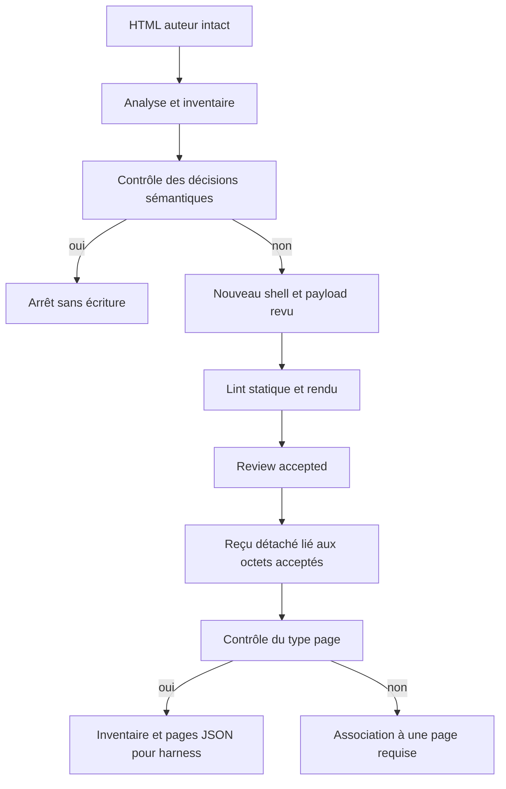
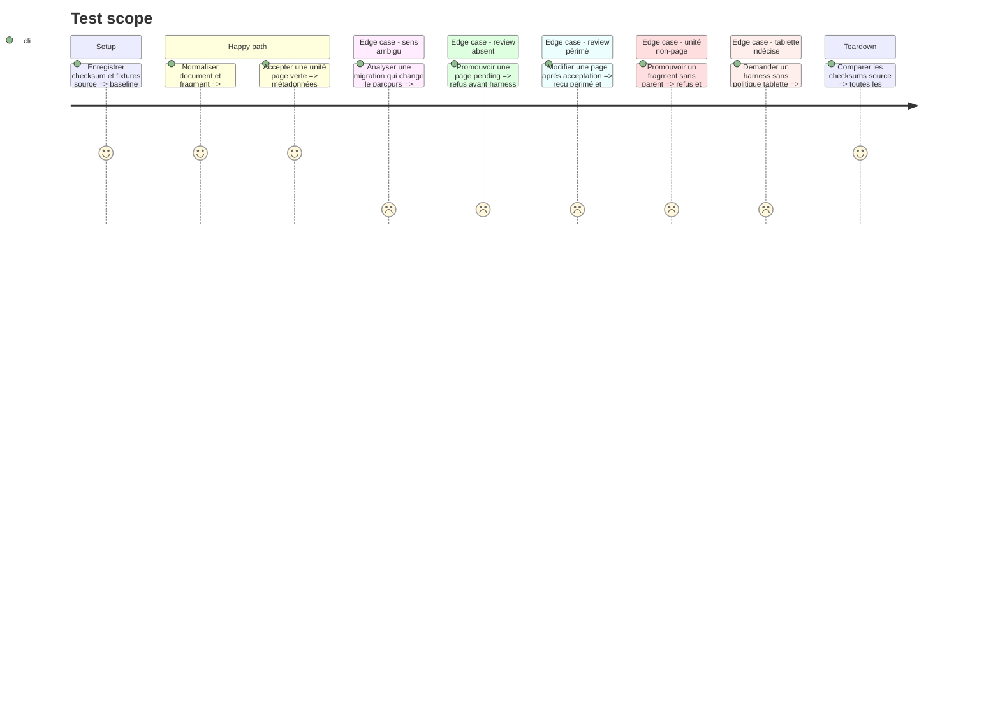

# Instruction: Normaliser les sources et promouvoir les pages acceptées

## Architecture projection

> Tree of the final files. ✅ create · ✏️ modify · ❌ delete

```txt
plugins/design/
├── adapters/wireframes/fixtures/
│   ├── normalize-document.html                     ✅ couvrir un document auteur complet
│   ├── normalize-fragment.html                     ✅ couvrir un fragment et son contexte intrinsèque
│   ├── normalize-annotation-heavy.html             ✅ couvrir le zoning documenté à reconstruire
│   ├── normalize-states.html                       ✅ couvrir état initial et transitions de page
│   └── normalize-ambiguous.html                    ✅ bloquer une migration qui changerait le sens
├── skills/wireframes/
│   ├── SKILL.md                                     ✏️ publier les routes normalize et promote désormais exécutables
│   ├── actions/
│   │   ├── 02-normalize.md                         ✅ brancher analyse, reconstruction et inventaire
│   │   └── 04-promote.md                           ✅ brancher acceptation et handoff officiel
│   └── evals/
│       ├── scenarios.json                          ✏️ activer les deux nouvelles routes et leurs contre-cas
│       └── routing-autonomy-scenarios.md           ✏️ prouver normalize et promote de bout en bout
├── references/
│   ├── wireframe-normalization.md                  ✏️ préciser classifications et preuve de migration
│   └── wireframe-harness-handoff.md                ✏️ préciser signature et politique tablette
└── tools/
    ├── wireframes-analyze.py                       ✅ classifier et inventorier une source HTML
    ├── wireframes-handoff.py                       ✅ produire métadonnées, payload et décisions pour harness
    ├── wireframes-review.py                        ✅ écrire ou révoquer un reçu d’acceptation détaché
    ├── wireframes-apply.py                         ✏️ accepter un inventaire de migration revu
    └── wireframes-selftest.sh                      ✏️ couvrir normalisation et promotion
```

## User Journey



## Test Scope



## Tasks to do

### `1)` Analyser sans adopter le document arbitraire

> Distinguer planche canonique, document, fragment et source ambiguë avant toute écriture.

1. Inventorier markup, styles, scripts, ressources, unités candidates, états, annotations et provenance.
2. Identifier les dépendances externes, les interactions qui cachent du contenu et les mappings unité/état non résolus.
3. Arrêter avant écriture lorsque plusieurs sens ou parcours restent défendables.
4. Produire une classification et un inventaire JSON stables, sans modifier la source.

### `2)` Publier les deux routes devenues exécutables

> Ajouter normalisation et promotion seulement après l’existence de leurs outils et contrats.

1. Ajouter `normalize` et `promote` à la table et au routage de `SKILL.md`.
2. Créer leurs actions avec chemins portables, refus avant écriture et preuves de complétion.
3. Étendre les scénarios JSON et comportementaux avec HTML canonique, document, fragment, review périmé et politique tablette.

### `3)` Reconstruire dans un shell neuf

> Préserver le sens et les états utiles sans conserver le chrome ou la documentation déguisée.

1. Générer un nouveau shell avec le générateur canonique.
2. Vérifier l’inventaire de préservation, transformation et omission ; demander une décision humaine seulement lorsqu’un élément change de sens, de parcours ou de contenu métier.
3. Appliquer le payload revu, puis rejouer les lints statique et rendu.
4. Comparer checksum source, couverture des blocs et inventaire final ; refuser toute migration non résolue.

### `4)` Consigner l’acceptation humaine sans modifier la planche

> Lier l’accord du reviewer aux octets réellement examinés dans un reçu détaché.

1. Exiger une approbation explicite, une identité de reviewer et les deux rapports verts avant tout reçu.
2. Hasher les octets HTML exacts et les deux rapports, puis écrire atomiquement un reçu conforme à `wireframe-review.schema.json` sans modifier la planche.
3. Recalculer les trois digests au handoff ; toute différence rend le reçu périmé sans réécriture silencieuse.
4. Permettre une révocation explicite qui passe le reçu à `revoked` en conservant reviewer, date et digests pour audit.

### `5)` Préparer le passage au harness

> Exporter une décision explicite plutôt que faire ressembler le wireframe au harness.

1. Refuser tout manifeste dont le lint complet n’est pas vert, tout reçu absent ou révoqué, et tout digest HTML ou rapport qui ne correspond plus aux fichiers courants.
2. Exporter uniquement les unités `page` avec slug, label, group, route, source et theme connus.
3. Exiger pour chaque fragment ou composant une association explicite à une page et une zone.
4. Extraire pour chaque page le rendu de `initialState` comme corps initial du harness, sans migrer le chrome de planche ni juxtaposer les états.
5. Classer chaque autre état `retained-interactive|reference-only|omitted|unresolved` ; fournir déclencheur et mapping `afterRender` pour le premier, exiger une raison pour les deux suivants, conserver les états de référence dans l’inventaire, et bloquer sur `unresolved`.
6. Produire ensemble `pages.json`, `migration-payload.json` et `handoff.json`, tous liés au digest du reçu, pour la normalisation officielle du harness.
7. Accepter `tabletPolicy = desktop-derived|mobile-derived|defer` : `defer` produit seulement le handoff, et une valeur absente bloque avant toute création de harness.
8. Invoquer la normalisation officielle seulement après une politique non différée, puis vérifier les preuves propres au harness.

### `6)` Prouver immutabilité et frontières

> Fermer les chemins de normalisation et promotion avec des fixtures contradictoires.

1. Vérifier que chaque source garde son checksum et que chaque sortie a un chemin distinct.
2. Tester document, fragment, annotations excessives, dépendance absente et interaction ambiguë.
3. Tester reçu accepté, reçu absent, reçu révoqué, digest périmé, fragment sans page englobante, états interactif/omis/non résolu et trois politiques tablette contre le handoff.

## Test acceptance criteria

| Task | Acceptance criteria |
| ---- | ------------------- |
| 1 | Chaque source reçoit une classification, un inventaire et une liste de décisions ; une ambiguïté sémantique écrit zéro sortie. |
| 2 | Les quatre routes de la skill correspondent à quatre actions présentes et exécutables ; les nouveaux scénarios normalize/promote sélectionnent une route unique. |
| 3 | Les sorties normalisées sont canoniques, statiquement et visuellement vertes, avec inventaire complet et sources inchangées. |
| 4 | Une approbation écrit un reçu détaché sans modifier le HTML ; toute modification, altération des rapports ou révocation empêche la promotion jusqu’à un nouveau reçu. |
| 5 | Une page acceptée produit métadonnées, payload initial et inventaire d’états liés au digest ; aucun état non résolu n’atteint le harness ; `defer` s’arrête au handoff et une politique absente bloque. |
| 6 | Les contre-fixtures prouvent l’immutabilité, l’absence de dépendances adoptées silencieusement, les reçus absents/révoqués/périmés, les dispositions d’états et les trois politiques tablette. |
