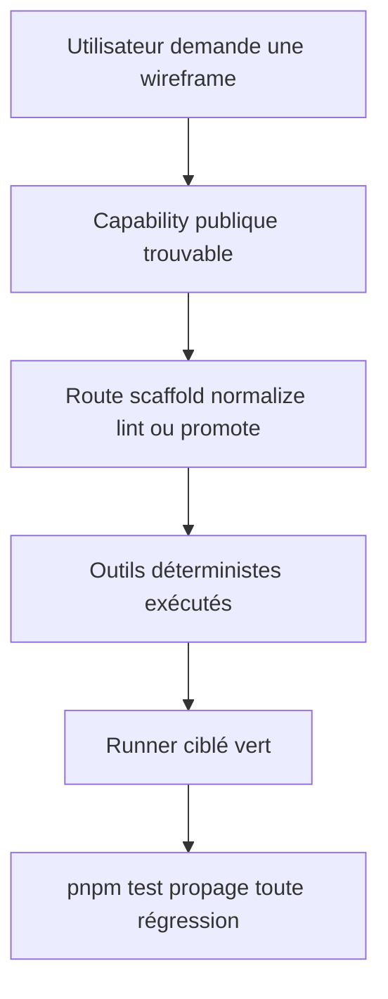
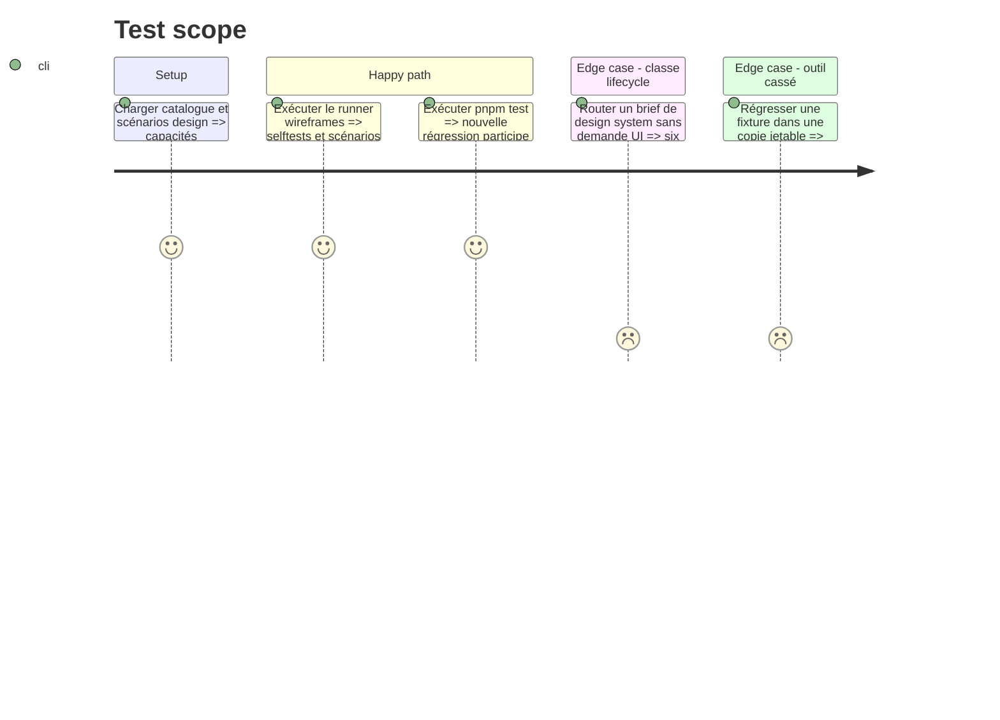

# Instruction: Intégrer la capacité au plugin et à ses preuves

## Architecture projection

> Tree of the final files. ✅ create · ✏️ modify · ❌ delete

```txt
.
├── package.json                                      ✏️ brancher la régression wireframes dans pnpm test
├── tools/eval/
│   ├── README.md                                     ✏️ documenter le runner ciblé
│   └── design-wireframes.mjs                         ✅ lancer les selftests portables et propager leurs exits
└── plugins/design/
    ├── README.md                                     ✏️ exposer la nouvelle capacité hors entonnoir
    ├── docs/
    │   ├── concepts.md                              ✏️ expliquer wireframes → harness sans autorité de contrat
    │   ├── workflow.md                              ✏️ indiquer le chemin préparatoire depuis un brief UI
    │   └── troubleshooting.md                       ✏️ documenter exits, erreurs statiques et rendues
    └── skills/
        ├── detail/
        │   ├── SKILL.md                             ✏️ compter et décrire les capacités hors entonnoir
        │   ├── actions/
        │   │   ├── 01-explain.md                    ✏️ restituer wireframes à la bonne granularité
        │   │   └── 02-route.md                      ✏️ garder les six classes et nommer le préalable optionnel
        │   ├── references/
        │   │   ├── funnel-map.md                    ✏️ ajouter wireframes avant harness
        │   │   └── workflow-classes.md              ✏️ préciser que wireframes n’est pas une classe
        │   └── evals/
        │       ├── scenarios.json                   ✏️ couvrir explication et routage préparatoire
        │       └── routing-autonomy-scenarios.md    ✏️ prouver absence d’exécution cachée
        └── wireframes/evals/
            └── routing-autonomy-scenarios.md         ✏️ enregistrer les résultats exécutés
```

## User Journey



## Test Scope



## Tasks to do

### `1)` Positionner la capacité dans la carte

> Rendre le nouveau point d’entrée visible sans l’insérer artificiellement dans le lifecycle du contrat.

1. Ajouter `wireframes` aux capacités hors entonnoir, en amont de `harness`.
2. Décrire le chemin optionnel brief UI → wireframes → review → harness.
3. Maintenir les six classes de lifecycle et préciser que le préalable ne s’applique que lorsqu’une interface doit être explorée.
4. Mettre à jour les compteurs et tests textuels de `detail` qui supposent actuellement sept capacités.

### `2)` Documenter les frontières opérationnelles

> Faire converger README, concepts, workflow et dépannage vers les références normatives.

1. Ajouter la capacité, ses entrées, sorties et non-promesses au tableau public.
2. Pointer vers le contrat wireframe au lieu de recopier ses règles détaillées.
3. Documenter les prérequis Playwright, codes 0/1/2, distinction lint statique/rendu/review et promotion harness.

### `3)` Brancher la preuve au gate global

> Faire échouer le dépôt lorsque le contrat ou les outils wireframes régressent.

1. Créer un runner Node portable sur le modèle de `design-harness.mjs`.
2. Lancer le selftest sans navigateur dans `pnpm test` et propager strictement stdout, stderr et exit.
3. Garder le selftest Chromium ciblé explicite si l’environnement global ne possède pas Playwright ; son absence ne doit jamais produire une preuve verte de rendu.
4. Exécuter les scénarios comportementaux et enregistrer tally, écarts et citations d’instructions.

### `4)` Contre-prouver le gate

> Vérifier que la nouvelle couverture n’est pas décorative.

1. Casser successivement un invariant du manifeste, une route et une fixture dans une copie jetable.
2. Constater que le runner ciblé puis `pnpm test` deviennent non nuls.
3. Restaurer la copie saine et vérifier les deux commandes vertes.

## Test acceptance criteria

| Task | Acceptance criteria |
| ---- | ------------------- |
| 1 | `detail` expose wireframes et harness hors entonnoir sans créer de septième classe ni exécuter une capability. |
| 2 | README et docs distinguent exploration, mesure harness et conformité au contrat sans recopier les processus. |
| 3 | Le runner ciblé est portable, participe à `pnpm test` et ne transforme jamais l’absence de la preuve Chromium en succès rendu. |
| 4 | Une régression injectée fait échouer les gates ; la même chaîne redevient verte après restauration. |
