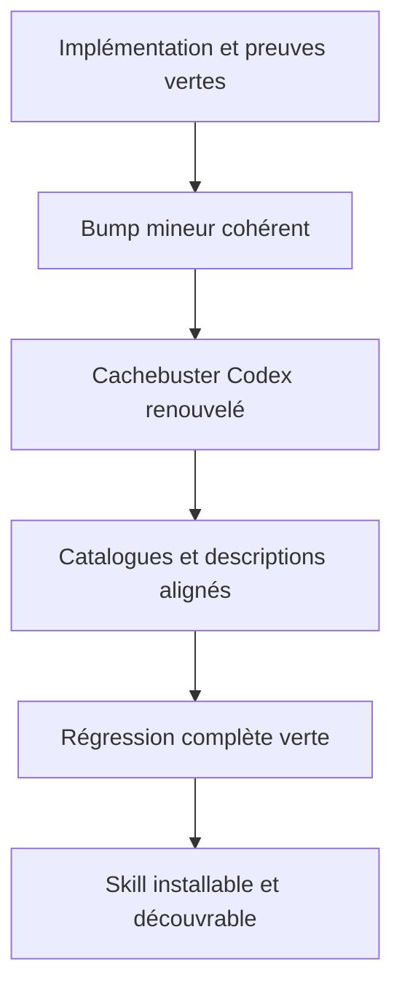
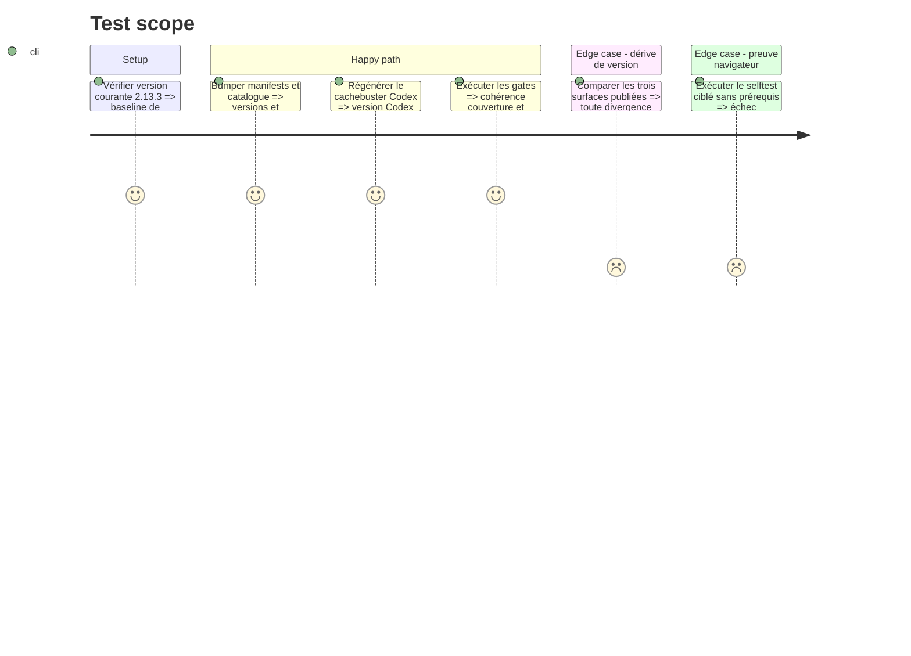

# Instruction: Publier `design` 2.14.0 et rejouer la régression

## Architecture projection

> Tree of the final files. ✅ create · ✏️ modify · ❌ delete

```txt
.
├── .claude-plugin/marketplace.json                  ✏️ publier design 2.14.0 et sa description
└── plugins/design/
    ├── .claude-plugin/plugin.json                   ✏️ porter la version et la description publiques
    ├── .codex-plugin/plugin.json                    ✏️ porter version, cachebuster, description et prompt d’exemple
    ├── CHANGELOG.md                                 ✏️ documenter capacité, frontières et preuves
    └── skills/
        ├── detail/SKILL.md                          ✏️ aligner le frontmatter sur la release qui le modifie
        ├── diffuse/SKILL.md                         ✏️ aligner le frontmatter sur la nouvelle frontière
        └── wireframes/SKILL.md                      ✏️ publier la nouvelle skill en 2.14.0
```

## User Journey



## Test Scope



## Tasks to do

### `1)` Préparer l’entrée de release

> Décrire ce qui est réellement livré et les preuves qui l’établissent.

1. Ajouter l’entrée `2.14.0` au CHANGELOG avec scaffold, normalisation, piliers, lints, review et handoff harness.
2. Citer les selftests déterministes et Chromium réellement exécutés, sans annoncer une preuve absente.
3. Mettre à jour la description publique et un exemple de prompt Codex pour rendre les wireframes standardisés découvrables sans transformer la description en inventaire détaillé.

### `2)` Synchroniser les surfaces de publication

> Publier le bump mineur et son contenu dans le même lot.

1. Porter le manifeste Claude et le catalogue Claude à `2.14.0` avec descriptions identiques.
2. Régénérer le cachebuster du manifeste Codex avec le flux officiel, sur la même base `2.14.0`.
3. Aligner les frontmatters des trois skills créées ou modifiées sur `2.14.0`.
4. Ne pas ajouter version ou description à `.agents/plugins/marketplace.json` ni à `index.json`, qui les omettent volontairement.

### `3)` Rejouer toutes les preuves

> Vérifier la capacité isolément puis le marketplace entier.

1. Exécuter le selftest statique, le selftest Chromium dans son environnement déclaré et le runner `design-wireframes`.
2. Exécuter `node tools/eval/consistency.mjs`, `node tools/eval/coverage.mjs` puis `pnpm test`.
3. Vérifier `git diff --check` et relire les changements pour confirmer qu’aucun fichier source ou contrat de projet n’a été modifié par les tests.

## Test acceptance criteria

| Task | Acceptance criteria |
| ---- | ------------------- |
| 1 | Le CHANGELOG décrit uniquement les comportements livrés et cite des preuves exécutées avec leurs résultats. |
| 2 | Claude et les trois frontmatters de skills annoncent `2.14.0`, Codex annonce la même base avec cachebuster, le catalogue Claude concorde et le gate M1 est vert. |
| 3 | Les selftests wireframes, consistency, coverage, `pnpm test` et `git diff --check` rendent 0 ; la vérification Chromium est explicitement exécutée et non inférée du lint statique. |
