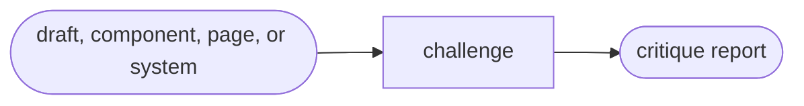

# Destructure

Read the action when this capability is selected.

| Action | Does |
| --- | --- |
| challenge | challenge a visual direction and propose alternatives |

## Routing

- "critique or challenge this design target" → `challenge`

## Transversal rules

- Resolve the plugin root using [host-portability.md](../../references/host-portability.md) before loading bundled tools or references.
- Work standalone on the target supplied by the user; a draft from another capability is optional.
- Never change the frozen contract or source code.
- Persist only the critique report unless the user requests conversation-only output.
- Produce concrete alternatives across distinction, consistency, accessibility, interaction states, responsive behavior, and reading hierarchy.
