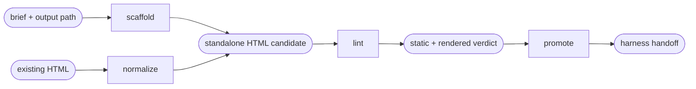

# Wireframes

Read only the next action selected by the request.

| Action | Does |
| --- | --- |
| scaffold | generate a canonical board from a manifest and reviewed author payload |
| normalize | inventory existing HTML and rebuild it in a fresh canonical shell |
| lint | statically and visually validate a board and optionally repair safe mechanical attributes |
| promote | accept a reviewed page board and emit a receipt-bound harness handoff |

## Routing

- "generate a standardized wireframe board from this brief" → `scaffold`
- "normalize this existing HTML or zoning into a wireframe" → `normalize`
- "lint or mechanically repair this wireframe HTML" → `lint`
- "accept and promote this wireframe page to the harness" → `promote`
- "turn the ASCII wireframe sketch from aidd-dev:01-plan's wireframe step into a validated board" → `scaffold`

## Transversal rules

- Resolve the plugin root using [host-portability.md](../../references/host-portability.md).
- Read [wireframe-contract.md](../../references/wireframe-contract.md) and [wireframe-manifest-schema.md](../../references/wireframe-manifest-schema.md).
- Require explicit, distinct input/output paths; never overwrite a brief, manifest, payload or source HTML.
- Select pillars from the evidence. Ask only when two selections materially change the board.
- Refuse missing or contradictory required references before writing. Never invent brand evidence.
- A static pass creates a candidate only. Do not call it a valid wireframe until rendered proof and human review also exist.
- Read [wireframe-normalization.md](../../references/wireframe-normalization.md) for `normalize` and [wireframe-harness-handoff.md](../../references/wireframe-harness-handoff.md) for `promote`.
- Read [wireframe-render-setup.md](../../references/wireframe-render-setup.md) before any rendered check (`lint`'s rendered pass, browser selftest): Playwright/Chromium install and `WIREFRAMES_CHROMIUM`.
- Read [wireframe-artifact-sourcing.md](../../references/wireframe-artifact-sourcing.md) before `normalize` on HTML sourced from a published claude.ai Artifact: viewer chrome precedes the author's own document.
- Never create or modify design-system contract artifacts.
