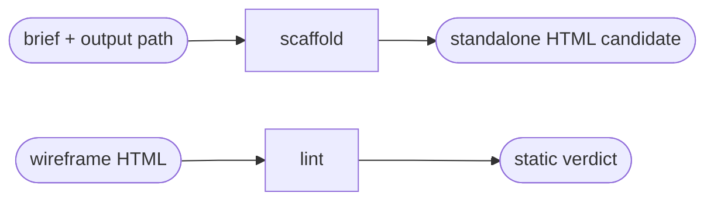

# Wireframes

Read only the next action selected by the request.

| Action | Does |
| --- | --- |
| scaffold | generate a canonical board from a manifest and reviewed author payload |
| lint | statically validate a board and optionally repair safe mechanical attributes |

## Routing

- "generate a standardized wireframe board from this brief" → `scaffold`
- "lint or mechanically repair this wireframe HTML" → `lint`
- Existing-HTML normalization and harness promotion are not public routes until their governed tools are present.

## Transversal rules

- Resolve the plugin root using [host-portability.md](../../references/host-portability.md).
- Read [wireframe-contract.md](../../references/wireframe-contract.md) and [wireframe-manifest-schema.md](../../references/wireframe-manifest-schema.md).
- Require explicit, distinct input/output paths; never overwrite a brief, manifest, payload or source HTML.
- Select pillars from the evidence. Ask only when two selections materially change the board.
- Refuse missing or contradictory required references before writing. Never invent brand evidence.
- A static pass creates a candidate only. Do not call it a valid wireframe until rendered proof and human review also exist.
- Never create or modify design-system contract artifacts.
