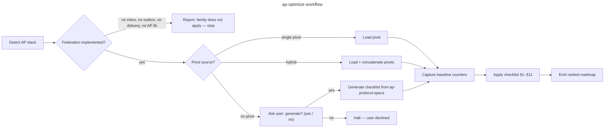

Read [host portability](../../references/host-portability.md) before resolving plugin files, invoking sibling skills, or persisting project guidance.

# ap-optimize

## Goal

Run a structured ActivityPub federation audit on a project — covering inbox processing, outbound delivery, protocol conformance, security, and observability — picking the right checklist for the detected stack, and emit an actionable roadmap.

## Rules

- Detect the AP stack BEFORE picking a checklist — never assume Django/Rails/Go
- **After detecting the stack, look for installed pivot rules** at `${PROJECT_RULES_ROOT}/07-quality/ap-pivots-<stack>.md` (provided by `sc-*` plugins — which plugin covers which stack is in `${OVERCODE_PLUGIN_ROOT}/references/pivot-providers.md`, never guessed; this family has far fewer providers than the others, so the table is the only safe answer). If found → load as the primary source for §1–§11. If not found → fall back to `references/ap-protocol-specs.md` + generic 11-section schema, **and say so in the output** — falling back is allowed, falling back silently is not. For hybrid stacks, load every matching `ap-pivots-*.md` and concatenate
- Capture a baseline (inbox request count, delivery queue depth, ProcessedActivity count, signature verify latency) BEFORE recommending changes — without baseline, gains are unfalsifiable
- If no pivot covers the detected stack, name the cause before proposing anything: **no plugin provides one** (the stack has no line in `${OVERCODE_PLUGIN_ROOT}/references/pivot-providers.md`) → propose generating a checklist; **a plugin provides one and nothing is installed here** → recommend that plugin and its install command, read from that table. Never silently fall back to a stack-mismatched checklist, and never run the installer yourself — this skill reports and recommends, it does not install (DEC-007 §2). All of this holds only where the family applies: a project that implements no federation is reported as such and gets neither proposal nor recommendation (Step 1)
- **Every report states the provenance of its checklist** — two fields, `source` and `pivot`, one pair per applicable stack. See Step 5 for the exact form
- Recommend changes only after reading at least these 3 files: (a) inbox view, (b) signature verification module, (c) delivery task. Generic advice without this evidence is rejected
- One row per checklist item, with `🟢 / 🟡 / 🔴 / N/A` + `file:line` references when actionable
- Output goes to `aidd_docs/tasks/audits/<yyyy_mm_dd>_ap-<stack>-<scope-slug>.md`. If `aidd_docs/` does not exist, fallback to `docs/ap-audits/<yyyy_mm_dd>_ap-<stack>-<scope-slug>.md` (create dir if needed). A `none` stack writes **no file** — the answer is one line in the conversation, not an empty report on disk
- If a same-day rerun produces a new file for the same scope, list existing files in the output directory first, find the highest existing suffix (`-v2`, `-v3`…), then append the next one — never attempt to write without checking existence first
- **Primary deterministic metrics**: inbox duplicate rate (`ProcessedActivity` / total inbox POSTs), delivery success rate, queue depth. Latency is secondary
- Cross-check every finding against `references/ap-protocol-specs.md` — a recommendation without spec anchor is rejected

## Quick Start

```bash
# 1. Detect the AP stack
ls */activitypub/ 2>/dev/null && echo "Django activitypub app detected"
grep -r "activitypub\|ActivityPub\|inbox\|outbox" pyproject.toml composer.json Gemfile Cargo.toml 2>/dev/null | head -10
grep -rn "httpx\|requests\|faraday\|httparty\|reqwest" . --include="*.py" --include="*.rb" --include="*.rs" -l 2>/dev/null | head -5

# 2. Baseline counters
python manage.py shell -c "from activitypub.models import ProcessedActivity; print(ProcessedActivity.objects.count())"
# Celery queue depth
redis-cli LLEN celery

# 3. Detect idempotency guard
grep -rn "ProcessedActivity" . --include="*.py" | head -10

# 4. Detect synchronous delivery (anti-pattern)
grep -rn "httpx\.\|requests\." . --include="*.py" | grep -v "await\|task\|celery\|delay"

# 5. Detect actor fetch without cache
grep -rn "fetch_actor\|get_actor" . --include="*.py" | grep -v "cache"
```

## Workflow



### Step 1: Detect AP stack

**Do:**

1. Read manifests: `pyproject.toml`, `Gemfile`, `composer.json`, `Cargo.toml`, `package.json`
2. Look for tell-tale signals:
   - **Django**: `activitypub/` app directory + `httpx` + `cryptography` in deps
   - **Rails**: `activitypub` gem OR custom `app/lib/activitypub/`
   - **Go**: `go-ap` or `gofed` imports
   - **PHP**: `activitypub` composer package OR custom namespace
3. Map to: `django-activitypub`, `rails-activitypub`, `go-ap`, `php-activitypub`, `other` — or to `none`, see 5
4. Check for hybrid: some projects use one backend for inbox and another for delivery (rare)
5. **Decide whether the family applies at all.** It applies if the project exposes an **inbox or outbox endpoint**, ships a **delivery path** for outbound activities, or declares an ActivityPub library. It does **not** apply on HTTP-signature code alone — signature verification is used by webhook APIs that never federate, and the greps above hit it. No such evidence → the stack is `none`: report it with what was looked for, and **stop there**. Do not continue to Step 2

**Success criteria:** Either a stack + AP implementation pattern (custom vs library) is reported, **or** the family is reported as not applying — `stack : none`, naming the evidence looked for and not found. Both are valid outcomes; the second is not a failure to detect.

### Step 2: Pick or propose checklist

**Do:**

1. Scan `${PROJECT_RULES_ROOT}/07-quality/ap-pivots-*.md` for matching stack. They are installed by `sc-*` plugins, each with its own install command — the mapping `<stack> → <plugin>, <command>` is in `${OVERCODE_PLUGIN_ROOT}/references/pivot-providers.md`
2. If found → load as primary source. Then **also load all supplementary pivots** present in `${PROJECT_RULES_ROOT}/07-quality/` — `perf-pivots-*.md` and `data-pivots-*.md` — to extend coverage with stack-specific patterns (e.g. Celery delivery, DRF serializer N+1). Concatenate with the AP pivot, AP pivot takes precedence on conflicts.
3. If not found → read the state right here and emit the recommendation now, without waiting for the terminal guard below:
   - the stack **has a line** in `pivot-providers.md` → recommend running that plugin's install command **in this project** (quote plugin + command verbatim from the table), then continue down the ladder
   - the stack **has no line** → `no provider`; nothing to recommend, generation is the only remedy. This is the common case here — the table lists a single AP provider

   Then look for `aidd_docs/templates/dev/ap_checklist_<stack>.md`
4. If neither found → halt and ask user:
   > "No AP pivot exists for `<stack>`. Options: (a) if `pivot-providers.md` lists a plugin for this stack, run its install command in this project — it is quoted in the recommendation above, (b) generate `ap_checklist_<stack>.md` from `references/ap-protocol-specs.md` fallback, or (c) abort."

   Option (a) is about **installing the rules here**, not about installing the plugin: the plugin is usually already present, and re-installing it is not the remedy. Where the table has no line at all, (a) does not apply and only (b) or (c) are offered.

   This guard presupposes that the family applies — Step 1 reported a stack other than `none`. On `none` the run has already stopped and this text is never emitted: proposing an install where nothing federates is a false positive, not a helpful default.
5. If user accepts generation: use the 11-section schema (§1–§11 below), write to `aidd_docs/templates/dev/ap_checklist_<stack>.md`

**Success criteria:** A checklist source is loaded, stack-appropriate, **and the pair `source` / `pivot` is determined for every applicable stack** — loading without reporting is the defect this step must not produce.

### Step 3: Capture baseline

**Do:**

1. **Idempotency baseline**: `ProcessedActivity.objects.count()` (or equivalent) before/after a known inbox POST
2. **Queue depth**: Celery `ap_delivery` queue length (or equivalent) at rest
3. **Delivery success rate**: from logs — `ap:delivered:ok` / (`ap:delivered:ok` + `ap:delivered:fail`) over last 24h
4. **Signature verify latency**: `django-silk` or middleware timer on inbox POST — p50/p95
5. 3 runs minimum, quote median + min/max for queue depth (varies with activity)
6. Persist to `aidd_docs/tasks/audits/baselines/<scope-slug>.json` for cross-run comparison

**Success criteria:** Baseline counters quoted with source AND deterministic baseline recorded.

### Step 4: Apply checklist (§1–§11)

One row per item. Status: `🟢 compliant / 🟡 partial / 🔴 missing / N/A`.

**§1 — Inbox idempotency**: dedup guard present + race-safe (unique constraint or `select_for_update`)
**§2 — Signature verification**: present + headers checked + date skew + digest + before payload parse
**§3 — Fan-out delivery**: async (Celery/queue) + `on_commit` + one task per recipient + retry backoff
**§4 — Actor/key caching**: public key cached (Redis/DB) with TTL + cache invalidation on `Update Person`
**§5 — Outbox pagination**: `OrderedCollection` with `first` + `OrderedCollectionPage` with `partOf`/`next`/`prev`
**§6 — Rate limiting**: inbox POST rate-limited by IP + by remote host + returns 429 with `Retry-After`
**§7 — Circuit breaker**: per-domain failure counter + backoff mode after N failures + `410` → local delete
**§8 — AS2 conformance**: `@context`, `id` absolute URL, `type`, required properties per activity type
**§9 — Security**: actor URL SSRF guard + actor matches signature keyId + outgoing requests signed
**§10 — Observability**: inbox events logged + delivery events logged + metrics counters + alerting
**§11 — Verification**: idempotency test + SSRF test + replay test + delivery retry test

Quick verification commands:
```bash
# §1 — idempotency guard
grep -rn "ProcessedActivity" . --include="*.py"

# §2 — signature verified before payload use
grep -rn "verify_signature\|check_signature" . --include="*.py"

# §3 — no sync delivery in views
grep -rn "httpx\.\|requests\." . --include="*views*.py" --include="*inbox*.py"

# §4 — actor fetch with cache
grep -rn "fetch_actor\|get_actor" . --include="*.py" -A 3 | grep -v "cache\."

# §5 — outbox pagination
grep -rn "OrderedCollectionPage\|outbox" . --include="*views*.py" --include="*serializers*.py"

# §6 — rate limit on inbox
grep -rn "ratelimit\|rate_limit" . --include="*views*.py" --include="*inbox*.py"

# §7 — delivery failure handling
grep -rn "except\|retry" . --include="*tasks*.py" --include="*delivery*.py"

# §8 — @context on outgoing objects
grep -rn '"@context"' . --include="*.py" --include="*.json"

# §9 — SSRF guard
grep -rn "localhost\|127\.0\.0\|169\.254" . --include="*.py" | grep -v "test\|#"

# §10 — delivery logging
grep -rn "logger\." . --include="*tasks*.py" --include="*delivery*.py"
```

### Step 5: Emit roadmap

**Do:**

1. Intermediate review gate if > 15 🔴+🟡 items
2. Output to `aidd_docs/tasks/audits/<yyyy_mm_dd>_ap-<stack>-<scope-slug>.md`
   - `<stack>`: `django-activitypub`, `rails-activitypub`, etc.
   - `<scope-slug>`: `inbox`, `delivery`, `full-federation`, `actor-<name>` (lowercase, hyphen-separated)
3. **Provenance header** — right after the baseline block, before the phases, emit **one pair of fields per applicable stack**:

   ```
   <stack> — source : pivot <name> | template <name> | internal fallback ap-protocol-specs.md[ §<section>] | generated <file>
             pivot  : installed | not installed (<plugin>, <command>) | empty receptacle (<plugin>, <command>) | no provider
   ```

   - `source` is the rung **actually reached**, not the one intended.
   - `pivot` is the state of the plugin-provided rule, in the order of DEC-010 §1: `installed` · `not installed` (a plugin covers this stack, nothing is installed here) · `empty receptacle` (`${PROJECT_RULES_ROOT}/07-quality/` exists and holds no rule file — `.gitkeep` and service files do not count, a non-pivot rule does) · `no provider` (the stack has no line in the table). A **missing** receptacle is never `empty receptacle`: it is `not installed` or `no provider`.
   - **Two fields, never one.** They are independent axes and commonly both true — `pivot : not installed` with `source : internal fallback ap-protocol-specs.md` is the ordinary run. Merged into a single value, it is always `pivot` that gets lost.
   - `<plugin>` and `<command>` are quoted from `${OVERCODE_PLUGIN_ROOT}/references/pivot-providers.md` — never guessed, never derived from the family or the plugin name.
   - A polyglot repo gets one pair per stack: a single provenance value is wrong whichever value it takes (DEC-008).
   - A `none` stack has no pair: the family does not apply, and there is no checklist whose provenance could be stated. The one-line answer of Step 1 stands alone.
4. Phases ordered by security risk first (not ROI — federation has security-critical paths):
   - **F0 Security** — SSRF, missing signature verify, missing idempotency (ship immediately)
   - **F1 Reliability** — retry backoff, circuit breaker, delivery queue monitoring
   - **F2 Conformance** — AS2 types, outbox pagination, Content-Type headers
   - **F3 Performance** — actor cache TTL tuning, fan-out batching, sharedInbox
5. Each phase: estimated effort + risk + spec reference (W3C AP §, HTTP Sig §)
6. End with **Quick wins** (≤ 4 items) — prioritize security > reliability > conformance
7. Per-fix success criterion: idempotency → `ProcessedActivity` count; delivery → queue depth + success rate; signature → latency p95

### Step 6: Self-audit & skill feedback

**Do:**

1. Walk §11 of the loaded AP checklist — mandatory
2. Append `## Checklist learnings` to the audit report:
   - `[gap] §N: <missing bullet>`
   - `[fp] §N: <bullet> — reason N/A`
   - `[antipattern] <pattern> | <why rejected>` (≥ 2 occurrences OR OWASP/spec class)
   - `[spec] §N: <finding anchored to spec ref>`
   - `[grep] <command> — <what it surfaces>`
3. Trigger threshold ≥ 2 gaps OR ≥ 1 antipattern OR ≥ 1 missing pivot → propose patch to `ap-protocol-specs.md`
4. On user accept → apply; on reject → archive in report only

**Success criteria:** Every audit ends with `## Checklist learnings`, even if `[none]`.

## Resources

| Type | Path | Description |
|------|------|-------------|
| Reference | `references/ap-protocol-specs.md` | W3C ActivityPub, AS2, HTTP Signatures, WebFinger — spec anchors for all findings |
| Reference | `${OVERCODE_PLUGIN_ROOT}/references/pivot-providers.md` | `<stack> → <plugin>, <install command>` — the only place the remedy is read from. Plugin-root path, not skill-relative |
| Pivot | `${PROJECT_RULES_ROOT}/07-quality/ap-pivots-<stack>.md` | Absent from this project → Step 2 quotes the providing plugin and its install command from the table above, and says so in the provenance header. Absent from the table → `no provider`, and generation is the only remedy |
| Output | `aidd_docs/tasks/audits/<yyyy_mm_dd>_ap-<stack>-<scope-slug>.md` | Audit report destination |
| Baseline | `aidd_docs/tasks/audits/baselines/<scope-slug>.json` | Persisted counters for cross-run comparison |
