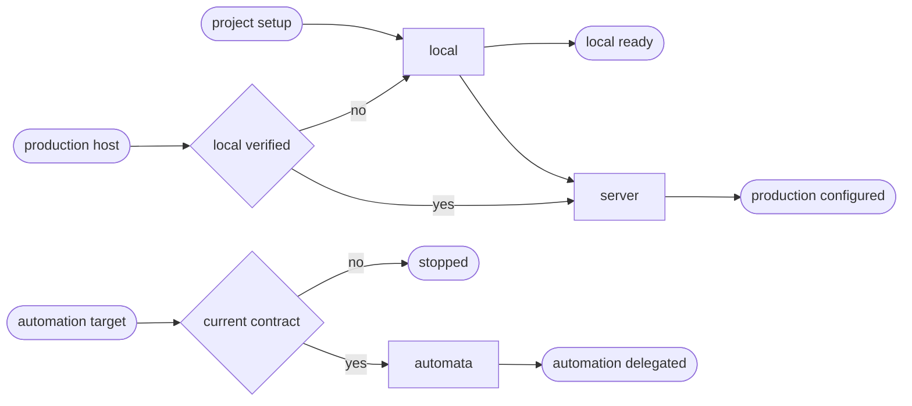

# CSS CD

## Actions

Run the flow above. Read only the next action file.

| Action | Does |
| --- | --- |
| local | reconcile a bounded static build and preview |
| server | reconcile one static production facade and contract |
| automata | validate and delegate the existing facade |

## Transversal rules

- Read [host portability](../../references/host-portability.md), [the common contract](../../references/cd-contract.md), and [the project schema](../../references/cd-project-contract.schema.json) before acting.
- Let sc-css own the root only for a pure static site with deterministic build, preview, and output evidence.
- Keep CSS as a bounded contributor when a language runtime owns the application.
- Never create another environment, contact production during configuration, or invent an unsupported output or provider.
