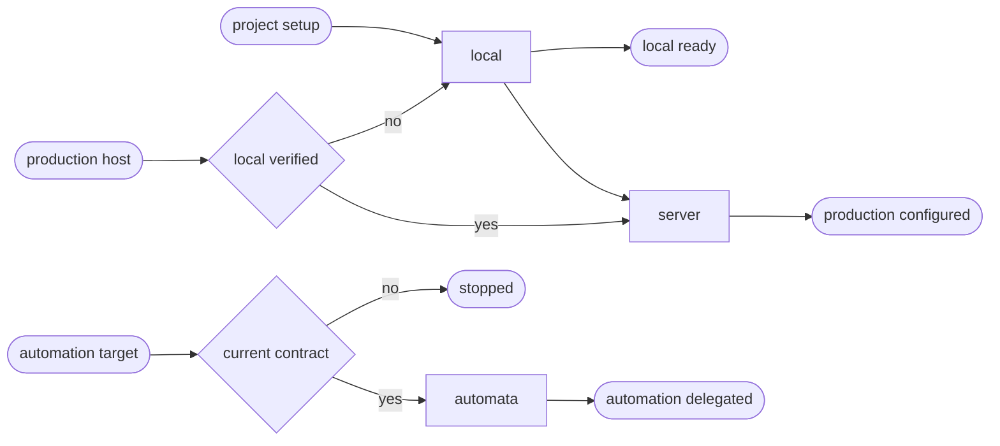

# JavaScript CD

## Actions

Run the flow above. Read only the next action file.

| Action | Does |
| --- | --- |
| local | reconcile the detected JavaScript runtime locally |
| server | reconcile a named server target through the native facade |
| automata | validate and delegate a named automata target |

## Transversal rules

- Read [host portability](../../references/host-portability.md), [the common contract](../../references/cd-contract.md), and [the project schema](../../references/cd-project-contract.schema.json) before acting.
- Reuse the existing sniff classification instead of maintaining a second stack taxonomy.
- Keep one root owner and limit JavaScript to a bounded workspace when another application stack owns the project.
- Never create another environment, replace a user command silently, or deploy merely because configuration was requested.
- Require an exact target id, lifecycle phase and `deploy:*` operation when multiple targets exist; never choose a default or copy between targets.
- Read [differential synchronization](../../references/cd-differential-sync.md) before staging mutable data or media. Production mutable surfaces are target-authoritative.
