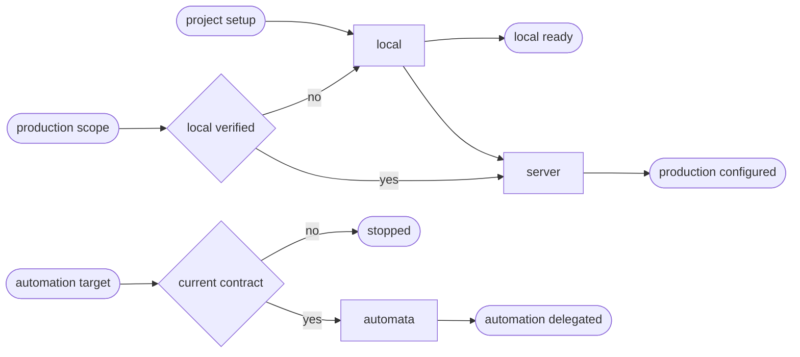

# PHP CD

## Actions

Run the flow above. Read only the next action file.

| Action | Does |
| --- | --- |
| local | reconcile the detected PHP framework locally |
| server | reconcile one scoped Composer delivery facade |
| automata | validate and delegate the existing facade |

## Transversal rules

- Read [host portability](../../references/host-portability.md), [the common contract](../../references/cd-contract.md), and [the project schema](../../references/cd-project-contract.schema.json) before acting.
- Keep one root owner and treat JavaScript and CSS as bounded contributors in WordPress applications.
- Keep code, configuration, migrations, database, editorial content, and media as separate named surfaces.
- Never create another environment, reset WordPress, destroy containers, import a database during setup, or deploy merely because configuration was requested.
