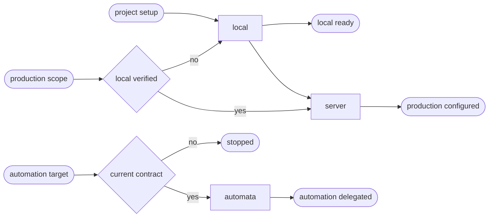

# Python CD

## Actions

Run the flow above. Read only the next action file.

| Action | Does |
| --- | --- |
| local | reconcile the detected Python runtime locally |
| server | reconcile a named server target preserving the delivery facade |
| automata | validate and delegate a named automata target |

## Transversal rules

- Read [host portability](../../references/host-portability.md), [the common contract](../../references/cd-contract.md), and [the project schema](../../references/cd-project-contract.schema.json) before acting.
- Reuse existing sniff evidence for manager, framework, runtime, workers, and data layer.
- Preserve the manager and lockfile already owned by the project and ask before adding a task runner.
- Never create another environment, invent an entrypoint, or deploy merely because configuration was requested.
- Select one declared target and one `deploy:*` operation before reading a delivery action. Never infer a default when several targets exist.
- Apply the target's `staging` or `production` authority and lifecycle guard from the common contract. Never copy between targets.
- Read [differential synchronization](../../references/cd-differential-sync.md) before planning mutable staging media or data.
