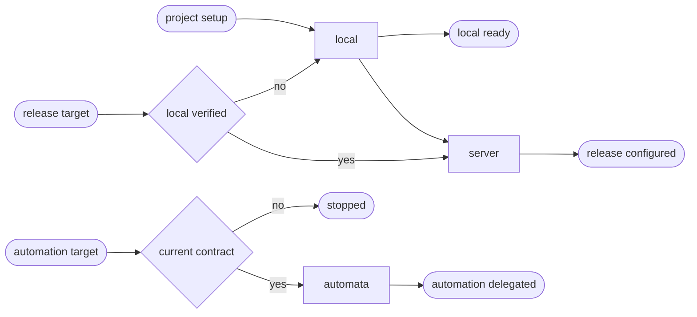

# Rust CD

## Actions

Run the flow above. Read only the next action file.

| Action | Does |
| --- | --- |
| local | reconcile the detected Rust workspace locally |
| server | reconcile a named target through one reversible release facade |
| automata | validate and delegate a named target through the same facade |

## Transversal rules

- Read [host portability](../../references/host-portability.md), [the common contract](../../references/cd-contract.md), and [the project schema](../../references/cd-project-contract.schema.json) before acting.
- Reuse existing sniff evidence for workspace, binary, framework, SQL crate, features, and target.
- Keep one versioned project facade that forwards arguments and exit codes identically locally and in automation.
- Never create another environment, invent Cargo capabilities, install a global tool implicitly, or deploy merely because configuration was requested.
- Require an exact target id, phase and `deploy:*` operation; scope release directories, pointers, locks and rollback to that target and never fall through to another.
- Read [differential synchronization](../../references/cd-differential-sync.md) before staging persistent data or files. Production mutable surfaces stay target-authoritative.
